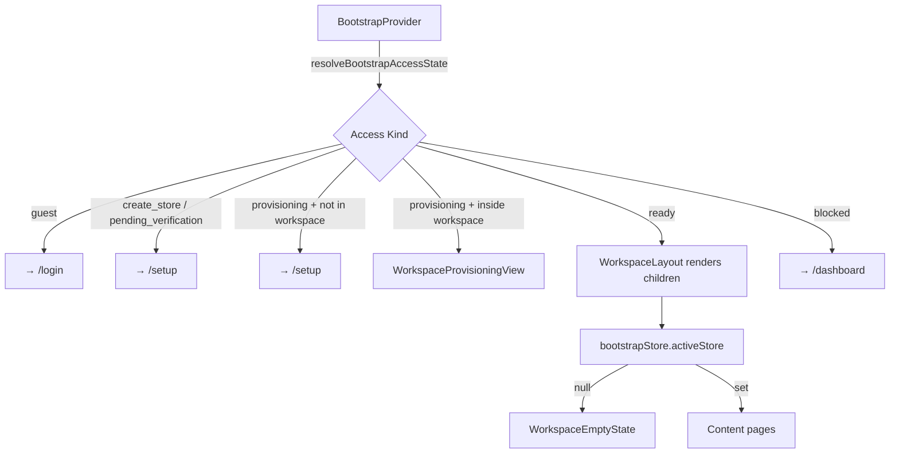

# Design Document: Merchant Workspace

## Overview

The merchant workspace introduces a persistent application shell at `/merchant` that replaces the current pattern of landing merchants directly in store-scoped routes (`/stores/{storeId}/dashboard`). It is a new `(merchant)` route group that sits alongside the existing `(dashboard)` and `(auth)` route groups, sharing the same provider hierarchy from `src/app/[locale]/layout.tsx`.

The design is strictly additive. No existing routes, components, stores, or API contracts are modified. The workspace composes existing infrastructure — `DashboardShell`, `useSwitchStore`, `CreateStoreStep`, `ProvisioningStep`, `resolveBootstrapAccessState`, and `bootstrapStore` — with workspace-specific callbacks and routing logic layered on top.

### Key Design Decisions

1. **Route group isolation**: `(merchant)` is a new parallel route group. The existing `(dashboard)` group is untouched.
2. **Shell reuse**: `DashboardShell` is reused directly. The workspace layout wraps it with a workspace-specific `SidebarNav` configuration and a workspace-aware `StoreSwitcher`.
3. **Guard extension**: `BootstrapProvider` is extended to classify `/merchant/*` as protected routes, using the same `resolveBootstrapAccessState` logic already in place for `/stores/*`.
4. **Provisioning interception**: `ProvisioningStep` is composed inside a `WorkspaceProvisioningView` wrapper that overrides the post-completion redirect from `ROUTES.store(id).dashboard()` to `ROUTES.merchant.dashboard()`. The component itself is not modified.
5. **Store switcher extension**: A new `WorkspaceStoreSwitcher` wraps the existing `useSwitchStore` hook and adds the "Add store" option. The existing `StoreSwitcher` in `(dashboard)` is not modified.
6. **Settings API**: `PUT /api/v1/stores/{store}` is added to `API_ROUTES.merchant.stores` and `src/lib/api/stores.ts`. A new `queryKeys.merchant.store(storeId)` key family is added.

---

## Architecture

### Route Group Structure

```
src/app/[locale]/
├── (auth)/                          # existing — unchanged
│   └── setup/
├── (dashboard)/                     # existing — unchanged
│   └── stores/[storeId]/
└── (merchant)/                      # NEW
    ├── layout.tsx                   # WorkspaceLayout — wraps DashboardShell
    └── merchant/
        ├── page.tsx                 # redirect → /merchant/dashboard
        ├── dashboard/
        │   └── page.tsx
        ├── orders/
        │   └── page.tsx
        ├── products/
        │   └── page.tsx
        ├── stores/
        │   ├── page.tsx             # store list
        │   ├── create/
        │   │   └── page.tsx         # multi-store creation
        │   └── [store]/
        │       └── settings/
        │           └── page.tsx     # store settings
        └── _provisioning/
            └── page.tsx             # workspace provisioning view (internal)
```

> The `_provisioning` segment uses the Next.js `_` prefix convention to mark it as a private route that is not directly navigable by users; the workspace shell renders it programmatically when `needsProvisioningFlow` is true.

### Feature Module Structure

```
src/features/merchant/
├── components/
│   ├── WorkspaceStoreSwitcher.tsx   # extends StoreSwitcher with "Add store"
│   ├── WorkspaceSidebarNav.tsx      # merchant-specific nav items
│   ├── WorkspaceProvisioningView.tsx # composes ProvisioningStep with workspace redirect
│   └── WorkspaceEmptyState.tsx      # shown when activeStore is null on content routes
├── stores/
│   ├── StoreList.tsx                # /merchant/stores page content
│   ├── StoreListItem.tsx            # individual store row
│   └── CreateStorePage.tsx          # /merchant/stores/create page content
└── settings/
    ├── StoreSettingsForm.tsx        # /merchant/stores/[store]/settings form
    └── useUpdateStore.ts            # TanStack mutation for PUT /api/v1/stores/{store}
```

### Data Flow



---

## Components and Interfaces

### WorkspaceLayout (`src/app/[locale]/(merchant)/layout.tsx`)

Server component. Reads `x-tenant-slug` from headers (same as `DashboardLayout`), renders `TenantInitializer` and `DashboardShell` with workspace-specific children.

```typescript
interface WorkspaceLayoutProps {
  children: React.ReactNode;
  params: Promise<{ locale: string }>;
}
```

The layout passes no `storeId` — the workspace is store-context-agnostic at the layout level. Store context is read from `bootstrapStore.activeStore` inside child components.

### WorkspaceSidebarNav (`src/features/merchant/components/WorkspaceSidebarNav.tsx`)

Client component. Replaces `SidebarNav` for the merchant workspace. Renders navigation items pointing to `/merchant/*` routes instead of `/stores/{storeId}/*`. Uses the same `SidebarNavItem` primitive.

```typescript
// No props — reads activeStore from bootstrapStore internally
export function WorkspaceSidebarNav(): JSX.Element
```

Nav items configuration (data-driven, satisfies Requirement 12.2):

```typescript
interface WorkspaceNavItem {
  labelKey: string;       // next-intl translation key
  href: string;           // from ROUTES.merchant.*
  icon: LucideIcon;
  permissionKey?: UiPermissionKey;  // optional permission gate
  exact?: boolean;
}
```

### WorkspaceStoreSwitcher (`src/features/merchant/components/WorkspaceStoreSwitcher.tsx`)

Client component. Wraps `useSwitchStore` and renders all stores from `bootstrapStore.stores`. Adds an "Add store" separator item that navigates to `ROUTES.merchant.stores.create()`. Non-active stores are rendered as disabled `SelectItem` elements.

```typescript
// No props — reads from bootstrapStore
export function WorkspaceStoreSwitcher(): JSX.Element
```

Key behaviors:
- Active stores (`status === 'active' && is_active === true`): selectable
- Non-active stores: rendered with disabled styling and a status badge
- "Add store" item: always present, navigates to `/merchant/stores/create`
- While `switchStoreMutation.isPending`: trigger disabled, loading indicator shown
- While provisioning is in progress (`needsProvisioningFlow` returns true): store switching disabled entirely

### WorkspaceProvisioningView (`src/features/merchant/components/WorkspaceProvisioningView.tsx`)

Client component. Composes `ProvisioningStep` inside the workspace layout. Intercepts the post-completion redirect by monitoring `bootstrapStore` state and redirecting to `ROUTES.merchant.dashboard()` when the store becomes ready, before `ProvisioningStep`'s own redirect fires.

Implementation approach: render `ProvisioningStep` inside a wrapper that uses a `useEffect` watching `bootstrap.active_store` + `provisioning.status`. When `status === 'completed'` and `isBootstrapStoreReady(bootstrap.active_store)` is true, the wrapper redirects to `ROUTES.merchant.dashboard()`. Since `ProvisioningStep` also has a redirect effect, the wrapper must redirect first (same render cycle, earlier in the component tree).

```typescript
export function WorkspaceProvisioningView(): JSX.Element
```

### StoreSettingsForm (`src/features/merchant/settings/StoreSettingsForm.tsx`)

Client component. Form for editing store name. Uses `react-hook-form` + `zod` (matching existing form patterns). Calls `useUpdateStore` mutation on submit.

```typescript
interface StoreSettingsFormProps {
  store: Store;  // passed from page, sourced from bootstrapStore.stores
}
```

Validation schema:
```typescript
const schema = z.object({
  name: z.string().min(3, 'Store name must be at least 3 characters.'),
});
```

On success: calls `bootstrapStore.fetchBootstrap()` to refresh the store name in the switcher and sidebar.

### useUpdateStore (`src/features/merchant/settings/useUpdateStore.ts`)

TanStack `useMutation` hook. Calls `PUT /api/v1/stores/{store}` via `updateStore()` from `src/lib/api/stores.ts`. On success, invalidates `queryKeys.merchant.store(storeId).detail()` and triggers a bootstrap refresh.

```typescript
export function useUpdateStore(storeId: string): UseMutationResult<
  ApiResponse<Store>,
  ApiError,
  UpdateStorePayload
>
```

---

## Data Models

### ROUTES extension (`src/config/routes.ts`)

```typescript
merchant: {
  home:      () => '/merchant' as const,
  dashboard: () => '/merchant/dashboard' as const,
  orders:    () => '/merchant/orders' as const,
  products:  () => '/merchant/products' as const,
  stores: {
    list:     () => '/merchant/stores' as const,
    create:   () => '/merchant/stores/create' as const,
    settings: (store: string) => `/merchant/stores/${store}/settings` as const,
  },
},
```

### API_ROUTES extension (`src/config/routes.ts`)

Added to `API_ROUTES.merchant.stores`:

```typescript
update: (store: string) => `/api/v1/stores/${store}` as const,
detail: (store: string) => `/api/v1/stores/${store}` as const,
```

### queryKeys extension (`src/lib/queryKeys.ts`)

```typescript
merchant: {
  store: (storeId: string) => ({
    all:    () => ['merchant', 'store', storeId] as const,
    detail: () => ['merchant', 'store', storeId, 'detail'] as const,
  }),
},
```

### UpdateStorePayload (`src/types/store.ts`)

```typescript
export interface UpdateStorePayload {
  name: string;
}
```

### updateStore API function (`src/lib/api/stores.ts`)

```typescript
export async function updateStore(
  storeId: string,
  payload: UpdateStorePayload,
  options: RequestOptions = {}
): Promise<ApiResponse<Store>> {
  return clientApi.put(API_ROUTES.merchant.stores.update(storeId), payload, { signal: options.signal });
}
```

---

## Correctness Properties

*A property is a characteristic or behavior that should hold true across all valid executions of a system — essentially, a formal statement about what the system should do. Properties serve as the bridge between human-readable specifications and machine-verifiable correctness guarantees.*

This feature is primarily a routing, composition, and UI shell feature. The core logic amenable to property-based testing is concentrated in two areas: (1) the routing guard classification logic, and (2) the store settings form validation. The property-based testing library used is [fast-check](https://fast-check.dev/) (already the standard for TypeScript PBT).

### Property 1: /merchant/* paths are always classified as protected routes

*For any* path string that starts with `/merchant`, the `isProtectedRoute` classification in `BootstrapProvider` SHALL evaluate to `true`, ensuring the guard logic is applied consistently to all workspace routes.

**Validates: Requirements 2.5, 10.7**

### Property 2: Unauthenticated access to /merchant/* always redirects to login

*For any* `/merchant/*` path, when `bootstrap` is `null` (unauthenticated state), `resolveBootstrapAccessState(null, null)` SHALL return `kind === 'guest'` with `redirectPath === ROUTES.auth.login()`.

**Validates: Requirements 2.1, 10.1**

### Property 3: Incomplete onboarding always redirects away from /merchant/*

*For any* bootstrap payload where `onboarding.step` is `'create_store'` or `'pending_verification'`, `resolveBootstrapAccessState` SHALL return a `redirectPath` of `ROUTES.setup()`, regardless of what other fields are present in the bootstrap payload.

**Validates: Requirements 2.2, 10.3**

### Property 4: Store name validation rejects short names

*For any* string with `length < 3` (including empty string and whitespace-only strings), the store settings form validation schema SHALL reject the input and prevent form submission.

**Validates: Requirements 8.7**

### Property 5: WorkspaceStoreSwitcher renders all stores from bootstrapStore

*For any* non-empty `stores` array from `bootstrapStore`, the `WorkspaceStoreSwitcher` SHALL render exactly one item per store, plus the "Add store" option, so that the total rendered item count equals `stores.length + 1`.

**Validates: Requirements 3.1, 3.5**

### Property 6: Non-active stores are always rendered as non-selectable

*For any* store in `bootstrapStore.stores` where `status !== 'active'` or `is_active === false`, the `WorkspaceStoreSwitcher` SHALL render that store's item in a disabled state, regardless of the store's other fields.

**Validates: Requirements 3.6**

---

## Error Handling

### Bootstrap Errors on Workspace Routes

When `bootstrapStore.bootstrapError` is non-null and the current path is a workspace route, `BootstrapProvider` already renders a full-screen error recovery UI (existing behavior). The workspace does not add a parallel error boundary — it relies on the existing `BootstrapProvider` error pattern.

### Store Switch Errors

`useSwitchStore` already handles errors via `onError` in the mutation config (toast + optional redirect). `WorkspaceStoreSwitcher` inherits this behavior without modification.

### Store Settings Update Errors

`useUpdateStore` surfaces field-level errors from the `PUT /api/v1/stores/{store}` response. `StoreSettingsForm` maps `apiError.errors.name` to the `name` field via `setError`, consistent with the `CreateStoreStep` pattern. A top-level `formError` state handles non-field errors.

### Store Not Found in Settings

When a merchant navigates to `/merchant/stores/{store}/settings` for a `store` slug/id not present in `bootstrapStore.stores`, the settings page renders a not-found state (inline, not a 404 page). This is a client-side guard — the page reads `bootstrapStore.stores` and finds no match.

### Provisioning Errors in Workspace

`WorkspaceProvisioningView` renders `ProvisioningStep` which already handles all provisioning error states (failed, timed out, offline). The workspace wrapper does not add additional error handling — it only overrides the success redirect.

### Multi-Store Creation Errors

`CreateStoreStep` handles all creation errors internally. When a non-retryable error occurs, `WorkspaceCreateStorePage` does not redirect to `/setup` — the error is displayed inline within the workspace layout, consistent with Requirement 6.6.

---

## Testing Strategy

### Unit Tests (example-based)

Focused on specific behaviors and conditional rendering:

- `WorkspaceStoreSwitcher`: renders all stores, highlights active store, shows "Add store" option, disables non-active stores, shows loading state during switch
- `WorkspaceProvisioningView`: renders `ProvisioningStep`, redirects to `/merchant/dashboard` on completion
- `StoreSettingsForm`: renders name field, disables submit for short names, shows field errors from API response, calls `useUpdateStore` on valid submit
- `WorkspaceSidebarNav`: renders correct nav items, highlights active route
- `BootstrapProvider` (extended): classifies `/merchant/*` as protected, does not redirect when `bootstrapResolved === false`
- Store list page: renders all stores with correct status badges, shows empty state when stores is empty

### Property-Based Tests (fast-check)

Each property test runs a minimum of 100 iterations.

**Tag format: `Feature: merchant-workspace, Property {N}: {property_text}`**

- **Property 1** — `fc.string()` filtered to paths starting with `/merchant`, assert `isProtectedRoute` is true
- **Property 2** — `fc.string()` filtered to `/merchant/*` paths, assert `resolveBootstrapAccessState(null, null).kind === 'guest'`
- **Property 3** — `fc.record(...)` generating bootstrap payloads with `onboarding.step` in `['create_store', 'pending_verification']`, assert `resolveBootstrapAccessState` returns `redirectPath === ROUTES.setup()`
- **Property 4** — `fc.string({ maxLength: 2 })` (including empty), assert zod schema rejects the input
- **Property 5** — `fc.array(fc.record(...), { minLength: 1 })` generating store arrays, render `WorkspaceStoreSwitcher`, assert rendered item count equals `stores.length + 1`
- **Property 6** — `fc.array(fc.record(...))` generating stores with `status !== 'active'` or `is_active === false`, assert all items are disabled

### Integration Tests

- `WorkspaceLayout` renders `DashboardShell` with workspace children
- `WorkspaceProvisioningView` integrates with `useProvisioningStatus` polling
- `useUpdateStore` calls `PUT /api/v1/stores/{store}` with correct payload and triggers bootstrap refresh on success

### What is NOT property-tested

- UI layout and visual rendering (snapshot tests instead)
- `BootstrapProvider` multi-tab sync (example-based tests)
- Middleware route protection (integration/E2E tests)
- `TenantInitializer` behavior (example-based test)
