# User Journeys & UX Analysis

> **Role**: Product Manager + UX Designer  
> **Scope**: Merchant, Admin, and Customer journeys across the entire application  
> **Method**: Codebase reconstruction of every screen, form, dialog, action, and navigation path  

---

## Table of Contents

1. [Role Definitions](#1-role-definitions)
2. [Merchant Journeys](#2-merchant-journeys)
3. [Admin Journeys](#3-admin-journeys)
4. [Customer Journeys](#4-customer-journeys)
5. [Cross-Role UX Problems](#5-cross-role-ux-problems)

---

## 1. Role Definitions

| Role | Access Scope | Entry Dashboard | Key Actions |
|---|---|---|---|
| **Merchant** | Own stores (multi-store) | `/merchant/dashboard` | Products, Orders, Customers, Theme, CMS, Settings |
| **Admin** | Platform-wide | `/admin/*` (estimated) | Manage stores, users, plans, system health, migrations |
| **Customer** | Storefront only | Storefront homepage | Browse products, add to cart, checkout |

#### Merchant Permission Model

Each merchant action is gated behind a `useCan()` permission key:

```
canViewDashboard    → Dashboard, stats
canManageOrders     → Order list, detail, status changes
canManageProducts   → Product CRUD
canManageCategories → Category CRUD
canManageBrands     → Brand CRUD
canManageTags       → Tag CRUD
canManageCmsPages   → CMS/marketing pages CRUD
canManageUsers      → Customer/user CRUD
(unrestricted)      → Theme, Stores, Settings
```

**Known bug**: Hero Banners uses `canManageBrands` permission key, not its own.

---

## 2. Merchant Journeys

---

### 2.1 First-Time Onboarding Journey

**User**: New merchant who just signed up  
**Goal**: Create first store and reach a usable dashboard  

```
Registration → Email Verification → Setup Wizard → First Dashboard
```

#### Journey Map

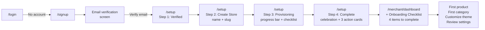

#### Step-by-Step

| Step | Screen | User Action | System Response | UX Notes |
|---|---|---|---|---|
| 1 | `/login` | Clicks "Create one" link | Navigate to `/signup` | Login has no "Forgot password?" link visible |
| 2 | `/signup` | Fills name, email, password, confirm | Password strength meter updates live | Good: strength bar. Missing: password policy hint |
| 3 | `/signup` | Clicks "Sign Up" | Loading state → redirect to verify | Good: loading state |
| 4 | Verify email screen | Opens email, clicks link | Redirects to `/email-verification-success` → "Go to Dashboard" | Verify-email page shows 2s countdown |
| 5 | Verify email screen (alt) | Clicks "I have verified my email" | Calls API, refreshes bootstrap | **Friction**: User may not see the auto-redirect; the manual button is needed |
| 6 | `/setup` Step 2 | Enters store name | Slug auto-generated, real-time availability check | **Good**: debounced slug check. **Friction**: user must create store before seeing dashboard |
| 7 | `/setup` Step 2 | Clicks "Create Store" | Loading → transitions to provisioning | **Missing**: What if slug is taken? Only inline validation shown |
| 8 | `/setup` Step 3 | Waits for provisioning | Animated checklist + progress bar | **Good**: visual lifecycle. **Missing**: estimated time remaining |
| 9 | `/setup` Step 4 | Sees celebration screen | 3 action cards + "Go to Dashboard" | **Missing**: CTA to invite team members |
| 10 | `/merchant/dashboard` | Sees onboarding checklist | 4 items with checkmarks, "Hide this" dismiss | **Good**: persisted per-store in localStorage. **Missing**: progress indicator for checklist |

#### Decision Points

1. **Verify email now or later?** → Must verify to proceed. Hard gate.
2. **Create generic store or specific?** → Only one shot in this flow. No industry/type selection.
3. **Continue to dashboard or explore?** → Dashboard has checklist that guides next steps.

#### Friction Points

| Issue | Severity | Impact |
|---|---|---|
| Must complete full setup before seeing any dashboard content | High | User invests 3-5 min before seeing value |
| No store type/industry selection during setup | Medium | Store created blind — no template applied |
| No "invite team members" at completion step | Medium | Solo merchant experience — no collaboration hook |
| Email verification blocks all progress | Medium | User stuck if email delayed or goes to spam |
| Forgot password link absent from login form | Medium | User must navigate to `/forgot-password` manually |

---

### 2.2 Daily Workflow Journey

**User**: Established merchant managing their store day-to-day  
**Goal**: Check performance, process new orders, manage inventory  

```
Login → Dashboard → Orders → Order Detail → (optional) Status Update → Products
```

#### Journey Map

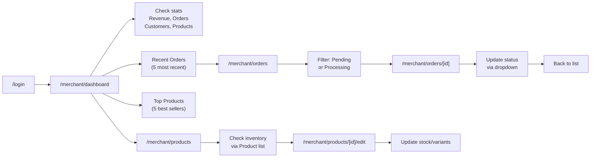

#### Step-by-Step

| Step | Screen | User Action | UX Notes |
|---|---|---|---|
| 1 | Login | Enter credentials | Supports `?redirect=` param back to original page |
| 2 | Dashboard | Scan 4 stat cards (Revenue, Orders, Customers, Products) with trend arrows | **Good**: at-a-glance KPI |
| 3 | Dashboard | Scroll to Recent Orders table | Click order number → detail |
| 4 | Dashboard | Scroll to Top Products list | Click product name → edit |
| 5 | Orders List | Apply status filter | URL-based filters persist on refresh |
| 6 | Order Detail | View customer info, line items, summary | Read-only, no inline editing |
| 7 | Order Detail | Change status via dropdown | Instant mutation, no confirmation dialog |
| 8 | Products List | Search by name, filter by status | Debounced search |

#### Decision Points

1. **Which orders to process first?** → Filter by status. No urgency indicator.
2. **Update product inventory from list or detail?** → Must go into edit page. **Friction**: no inline stock edit.

#### Friction Points

| Issue | Severity | Impact |
|---|---|---|
| No "Mark as shipped" quick action on order list row | High | Must click into detail → scroll → change status = 3 extra clicks |
| No inline stock editing in product list | Medium | Must open edit page tab for every product |
| Dashboard doesn't show low-stock alerts | High | Merchant must manually check each product |
| No order urgency sorting (oldest pending first) | Medium | Important orders may be missed |
| No export to CSV for any list | Medium | Can't export order/product data for external use |
| No keyboard shortcuts for power users | Low | All navigation is click-based |
| No notification badge for new orders | Medium | Must manually refresh or navigate to orders |

---

### 2.3 Product Management Journey

**User**: Merchant adding or editing products  
**Goal**: Create a product with full details, or update existing inventory  

```
Products List → Create (4-step wizard) / Edit (3-tab editor) → Review → Save
```

#### Journey Map

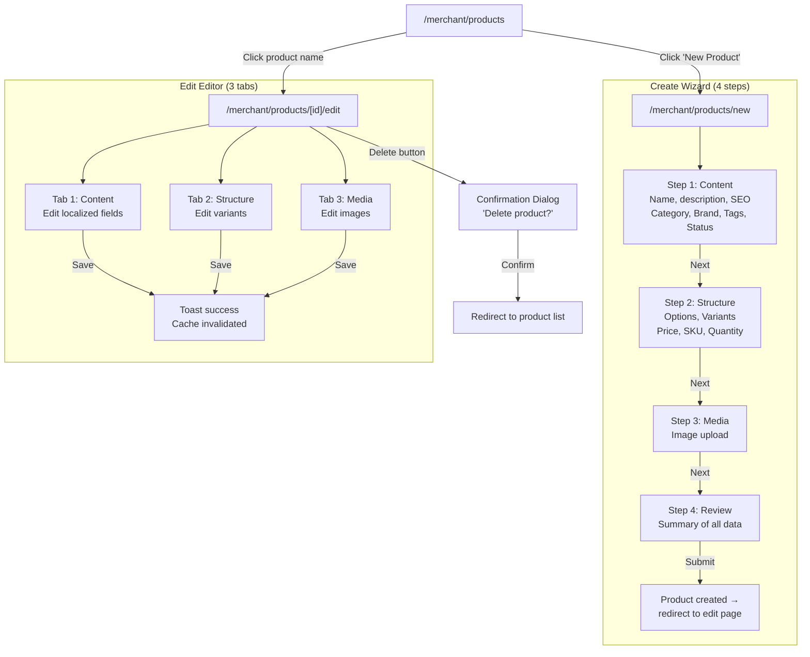

#### Step-by-Step

| Step | Screen | User Action | UX Notes |
|---|---|---|---|
| 1 | Product List | Clicks "New Product" | Navigates to 4-step wizard |
| 2 | Step 1: Content | Fills name, description per locale, selects category/brand, sets status, adds tags | **Good**: localized EN/AR. **Friction**: 4 steps before seeing product |
| 3 | Step 2: Structure | Adds options (Size, Color), generates variants, sets prices/SKUs/qty per variant | **Good**: dynamic combination generation |
| 4 | Step 3: Media | Uploads product images | No blocking validation on this step |
| 5 | Step 4: Review | Reviews all entered data before submission | **Good**: final review before commit |
| 6 | Product Edit | Edits content tab, saves independently per tab | **Good**: unsaved changes guard. **Warning**: 3 separate API calls if editing all tabs |
| 7 | Product Edit | Clicks "Delete" | Dialog confirms. Redirect to list. |

#### Decision Points

1. **Draft or publish immediately?** → Status toggle in Step 1
2. **Use variants or simple product?** → Step 2 is optional structure
3. **Edit all tabs at once or one at a time?** → Each tab saves independently

#### Friction Points

| Issue | Severity | Impact |
|---|---|---|
| 4-step wizard is slow for simple products | High | A single-product merchant must click through 4 pages even for a basic item with no variants |
| Can't bulk-edit products | High | No multi-select → bulk status change, bulk price update |
| Can't duplicate a product | High | Must manually recreate complex products with many variants |
| No product import from CSV/Excel | High | Large catalog merchants must enter each product manually |
| Edit page requires independent tab saves | Medium | If user edits all 3 tabs, they must click Save 3 times |
| No inventory history / stock movement log | Medium | Can't see when/how stock changed |
| No product categories tree view | Low | Flat list only, no hierarchical browsing |

---

### 2.4 Order Management Journey

**User**: Merchant processing customer orders  
**Goal**: View, manage, and update order statuses  

```
Orders List (filtered) → Order Detail → Status Update → Back to List
```

#### Journey Map

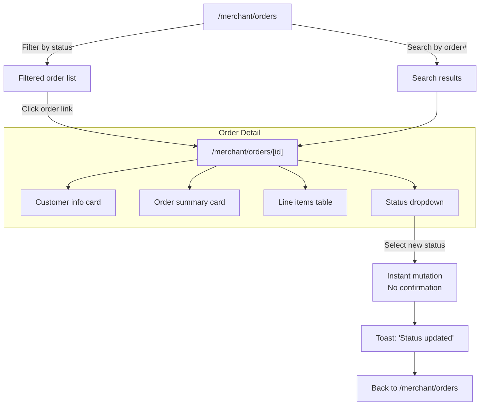

#### Step-by-Step

| Step | Screen | User Action | UX Notes |
|---|---|---|---|
| 1 | Orders List | Applies status filter (e.g., "Pending") | URL-persisted |
| 2 | Orders List | Searches by order number or customer name | Debounced 300ms |
| 3 | Order Detail | Views customer info | Read-only. No edit capability |
| 4 | Order Detail | Views line items | Read-only table |
| 5 | Order Detail | Changes status via dropdown | **Missing**: no confirmation dialog. Status changes are irreversible actions |
| 6 | Order Detail | Clicks back to list | **Friction**: No "Mark as shipped + go to next order" flow |

#### Decision Points

1. **Which order to process next?** → No priority/recommendation from system
2. **Assign order to a staff member?** → Impossible. **Missing feature**.

#### Friction Points

| Issue | Severity | Impact |
|---|---|---|
| No "quick action" dropdown on list rows | High | Must click into every order to change status |
| No batch status update | High | Can't select multiple orders and mark as shipped together |
| No order notes/comments from merchant | High | Can't add internal notes to orders |
| No order printing / packing slip generation | High | Physical merchants need printed slips |
| No confirmation dialog on status change | Medium | Accidental status change can't be undone easily |
| No email notification to customer on status change | Medium | Customer doesn't know order was shipped |
| No fulfillment/shipping tracking integration | Medium | Can't add tracking numbers |
| No refund/return flow | Medium | No partial refund, no return merchandise process |
| No order timeline/activity log | Low | Can't see when status was last changed |

---

### 2.5 Store Configuration Journey

**User**: Merchant configuring store settings  
**Goal**: Update store name, manage store list, create new stores  

```
Settings (active store) / Stores List → Create New Store / Edit Store Settings
```

#### Journey Map

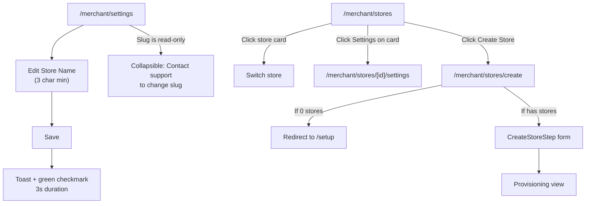

#### Step-by-Step

| Step | Screen | User Action | UX Notes |
|---|---|---|---|
| 1 | Settings | Edits store name | Live validation (min 3 chars) |
| 2 | Settings | Sees read-only slug | Help text + collapsible support contact |
| 3 | Settings | Clicks "Save changes" | Disabled when not dirty or invalid |
| 4 | Settings | Sees "Saved ✓" indicator | Auto-disappears after 3s |
| 5 | Stores List | Views all owned stores | Card layout with status badges |
| 6 | Stores List | Switches active store | Seamless, no page reload |
| 7 | Stores List | Clicks "Create store" | Redirects to setup if no stores exist yet |

#### Decision Points

1. **Which store to work in?** → Store switcher in topbar or Stores page
2. **Create new store or manage existing?** → Both paths available

#### Friction Points

| Issue | Severity | Impact |
|---|---|---|
| Only store name is editable in settings | **Critical** | No payment config, no shipping config, no tax config, no email config, no domain config |
| Slug can't be changed without contacting support | High | Blocks rebranding, URL changes |
| No store-level locale/language settings | High | Only product-level translations exist |
| No store logo / brand color configuration | High | Store appearance customization missing from settings |
| No payment gateway setup | Critical | How does the merchant accept payments? |
| No shipping zone/method configuration | Critical | How are shipping costs calculated? |
| No tax rate configuration | High | How is tax calculated? |
| No email template customization | Medium | Transactional emails use defaults |
| Store deletion not available in UI | Medium | No way to close/delete a store |

---

### 2.6 Theme Customization Journey

**User**: Merchant customizing store appearance  
**Goal**: Create, manage, and publish themes for the storefront  

```
Theme Overview → Create Theme / Select Theme → Navigation / Assets / Settings → Publish
```

#### Journey Map

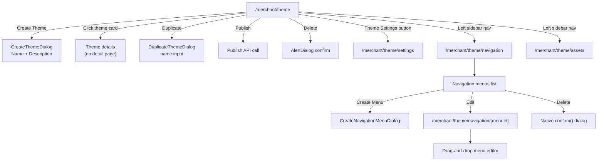

#### Step-by-Step

| Step | Screen | User Action | UX Notes |
|---|---|---|---|
| 1 | Theme Overview | Views theme cards grid | Shows active/draft status, sections count |
| 2 | Theme Overview | Clicks "Create Theme" | Opens dialog with name + description |
| 3 | Theme Overview | Hovers theme card → 3-dot menu | Publish, Duplicate, Delete options |
| 4 | Theme Overview | Clicks "Publish" (or full-width button) | Direct mutation, no confirmation |
| 5 | Theme Overview | Clicks "Delete" from dropdown | AlertDialog confirmation |
| 6 | Navigation List | Views navigation menus table | Paginated |
| 7 | Navigation List | Creates new menu | Auto-generates handle from name |
| 8 | Navigation Editor | Drag-and-drop menu items | **Missing**: no instructions for drag-and-drop |
| 9 | Assets | Manages uploaded files | List view |

#### Decision Points

1. **Create new theme or duplicate existing?** → Both paths from overview
2. **Publish now or keep as draft?** → Independent per-theme
3. **Which navigation menu to edit?** → Multiple menus possible per theme

#### Friction Points

| Issue | Severity | Impact |
|---|---|---|
| No visual theme editor / preview | **Critical** | Merchant can't see how their store looks — only manage assets and navigation |
| No theme marketplace or template library | High | Must create theme from scratch or duplicate existing |
| No color/font customization in theme settings | High | Merchant can't brand their store without code |
| No theme preview URL or staging environment | High | Can't preview unpublished theme on real storefront |
| Navigation editor has no instructions for drag-and-drop | Medium | New users may not discover reordering feature |
| Can't reorder theme cards (no sort/filter) | Low | Multiple themes displayed by creation date only |
| Native `confirm()` dialog for nav deletion (not styled dialog) | Medium | Inconsistent with rest of app which uses shadcn Dialogs |

---

### 2.7 Customer Management Journey

**User**: Merchant managing store users/customers  
**Goal**: View customer list, see details, add staff, remove users  

```
Customers List → Customer Detail (read-only) → Delete (optional)
Customers List → Add User (dialog)
```

#### Journey Map

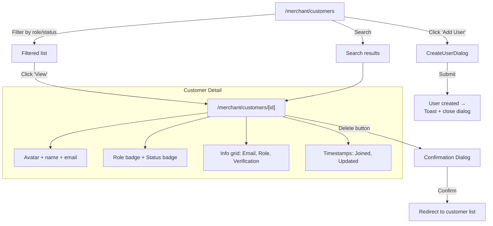

#### Step-by-Step

| Step | Screen | User Action | UX Notes |
|---|---|---|---|
| 1 | Customers List | Views table with avatars, names, emails, roles, statuses | Paginated |
| 2 | Customers List | Filters by role (Store Admin, Staff) or status (Active, Inactive) | URL-persisted |
| 3 | Customers List | Clicks "Add User" | Opens dialog with Name, Email, Role, Password |
| 4 | Customer Detail | Views user info | Fully read-only. No edit capability |
| 5 | Customer Detail | Clicks "Delete" | Dialog confirmation → redirect |

#### Decision Points

1. **Filter by role or view all?** → Two staff roles exist (Store Admin, Staff)
2. **Add user or view existing?** → Both available from list

#### Friction Points

| Issue | Severity | Impact |
|---|---|---|
| Customer detail page is completely read-only | **Critical** | Can't edit user name, email, role, or reset password |
| No customer purchase history / order list on detail page | **Critical** | Can't see what a customer has ordered |
| No customer total spend / lifetime value | High | No way to identify VIP customers |
| No customer notes or tags | High | Can't categorize or annotate customers |
| No customer address management | High | Can't view or edit shipping/billing addresses |
| No customer communication log | Medium | Can't see email history or interactions |
| No customer status toggle (active/inactive) | Medium | Must delete to remove access — no soft disable |
| No ability to impersonate / login as customer | Medium | Can't troubleshoot customer issues |

---

## 3. Admin Journeys

### 3.1 First-Time Onboarding Journey

**User**: New platform admin  
**Goal**: Set up the platform, create initial structure  

*Note: Admin section is partially mapped. Pages found include stores, users, plans, migrations, system health.*

```
Login → Admin Dashboard → Configure Platform → Manage Stores/Plans
```

| Step | Screen | Action | UX Notes |
|---|---|---|---|
| 1 | Login | Admin credentials | Separate login or same as merchant? Needs verification |
| 2 | Admin Dashboard | Platform-level stats | **Missing**: no admin dashboard content confirmed |
| 3 | Store Management | View all platform stores | Admin manages all tenant stores |
| 4 | Plan Management | Create/edit pricing plans | Monetization infrastructure |
| 5 | System Health | Check platform status | Operations monitoring |
| 6 | Migrations | Run database updates | Devops tooling |

#### Friction Points

| Issue | Severity |
|---|---|
| Admin routes and navigation not fully mapped — incomplete UI | Critical |
| No admin-specific sidebar detected — may reuse merchant sidebar | Medium |
| No analytics/comparison between stores | High |
| No store-level impersonation to troubleshoot | High |
| No billing/invoice overview across platform | High |

---

### 3.2 Admin Daily Operations Journey

**User**: Platform admin monitoring stores  
**Goal**: Oversee all stores, manage tenants, handle escalations  

```
Platform Dashboard → Store List → Store Detail → Manage
```

#### Friction Points

| Issue | Severity |
|---|---|
| No per-store analytics comparison | High |
| No store health/status overview dashboard | High |
| No automated alerts for store issues | High |
| No staff activity audit log across stores | Medium |

---

## 4. Customer Journeys

### 4.1 Customer Shopping Journey

**User**: End customer browsing a merchant's storefront  
**Goal**: Find and purchase products  

*Note: Storefront has only a layout file. No actual storefront page content exists yet.*

```
Storefront Homepage → Product Listing → Product Detail → Cart → Checkout
```

#### What Exists

| Component | Status |
|---|---|
| Storefront Layout | ✅ Built (header, nav, cart button, footer) |
| Homepage | ❌ Missing |
| Product List | ❌ Missing |
| Product Detail | ❌ Missing |
| Cart | ❌ Missing (cart button exists in layout but no page) |
| Checkout | ❌ Missing |

#### Friction Points

| Issue | Severity |
|---|---|
| **Storefront has no pages** — only a layout shell | **Critical** — storefront is non-functional |
| Cart button exists in layout but leads nowhere | **Critical** — broken UX |
| No product browsing/search for customers | **Critical** — entire customer experience missing |
| No checkout/payment flow | **Critical** — can't complete purchases |
| No customer account / order history | **Critical** — no post-purchase experience |
| Storefront APIs exist (products, cart, checkout) but no UI | **Critical** — APIs ready, frontend missing |

---

### 4.2 Customer Account Journey

**User**: Customer managing their account  
**Goal**: View orders, manage profile  

*Not built. No customer account pages exist.*

| Needed Feature | Status |
|---|---|
| Customer login/register | ❌ (Auth exists for merchants, not customers) |
| Order history | ❌ |
| Address book | ❌ |
| Wishlist | ❌ |
| Saved payment methods | ❌ |

---

## 5. Cross-Role UX Problems

### 5.1 Consolidated Friction Map

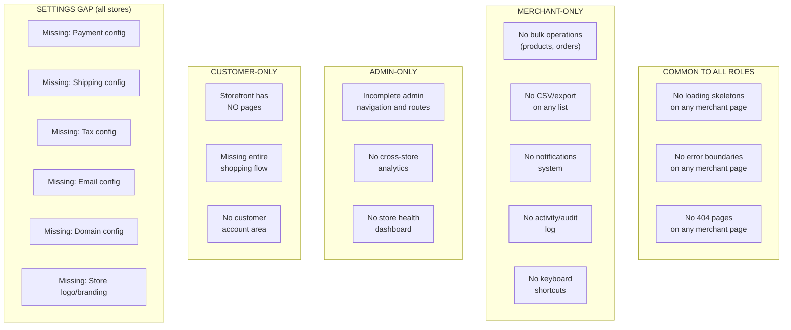

### 5.2 Missing Confirmations

| Action | Has Confirmation? |
|---|---|
| Delete product | ✅ Dialog |
| Delete category | ✅ Dialog |
| Delete brand | ✅ Dialog (with restore) |
| Delete tag | ✅ Dialog (hard delete, no restore) |
| Delete hero banner | ✅ Dialog (with restore) |
| Delete CMS page | ✅ Dialog |
| Delete user | ✅ Dialog |
| Delete theme | ✅ AlertDialog |
| Delete navigation menu | ❌ **Native `confirm()` — inconsistent** |
| Publish theme | ❌ **No confirmation — direct mutation** |
| Change order status | ❌ **No confirmation — irreversible** |
| Switch store | ❌ **No confirmation — context switch** |
| Logout | ❌ **No confirmation** |

### 5.3 Missing Empty States

| Context | Has Empty State? |
|---|---|
| Products list (no results) | ✅ DataTableEmptyState |
| Orders list (no results) | ✅ DataTableEmptyState |
| Customers list (no results) | ✅ DataTableEmptyState |
| Categories list (no results) | ❌ Not confirmed |
| Brands list (no results) | ❌ Not confirmed |
| Tags list (no results) | ❌ Not confirmed |
| Hero Banners list (no results) | ❌ Not confirmed |
| CMS Pages list (no results) | ✅ Text: "No pages yet" |
| Theme list (no results) | ✅ Text + "Create first theme" |
| Navigation menus (no results) | ✅ Dashed border + text |
| Dashboard (no recent orders) | ✅ "No recent orders" |
| Dashboard (no top products) | ✅ "No top products yet" |
| No active store (all pages) | ✅ WorkspaceEmptyState |

### 5.4 Dead Ends

| Path | Problem |
|---|---|
| `/merchant/customers/[id]` | Can view customer detail but can't edit anything |
| `/merchant/settings` | Can only edit store name — no other configuration |
| `/merchant/stores/create` | Redirects to `/setup` if user has 0 stores (infinite loop if setup is already completed) |
| Theme card click | Card itself is not clickable — only dropdown actions |
| Storefront cart button | Exists in layout but goes nowhere |
| `/sign-in` → `/sign-up` | Clerk auth routes — may be dead if Clerk is not configured |

### 5.5 Missing Screens (Highest Priority)

| Missing Screen | Role | Urgency |
|---|---|---|
| Storefront homepage | Customer | **CRITICAL** |
| Storefront product listing | Customer | **CRITICAL** |
| Storefront product detail | Customer | **CRITICAL** |
| Shopping cart page | Customer | **CRITICAL** |
| Checkout page | Customer | **CRITICAL** |
| Customer account/orders page | Customer | **CRITICAL** |
| Customer login | Customer | **CRITICAL** |
| Payment gateway settings | Merchant | **CRITICAL** |
| Shipping settings | Merchant | **CRITICAL** |
| Tax settings | Merchant | **HIGH** |
| Email/notification settings | Merchant | **HIGH** |
| Domain/custom domain settings | Merchant | **HIGH** |
| Product category tree/hierarchy | Merchant | **HIGH** |
| Order fulfillment/tracking | Merchant | **HIGH** |
| Refund/return management | Merchant | **HIGH** |
| Bulk product import/export | Merchant | **HIGH** |
| Theme preview/staging | Merchant | **HIGH** |
| Customer edit form | Merchant | **HIGH** |
| Customer purchase history | Merchant | **HIGH** |
| Activity/audit log | Merchant/Admin | **MEDIUM** |
| Cross-store analytics | Admin | **MEDIUM** |
| Store health dashboard | Admin | **MEDIUM** |

---

## 6. Mermaid User-Flow Diagrams

### 6.1 Complete Merchant Ecosystem Flow

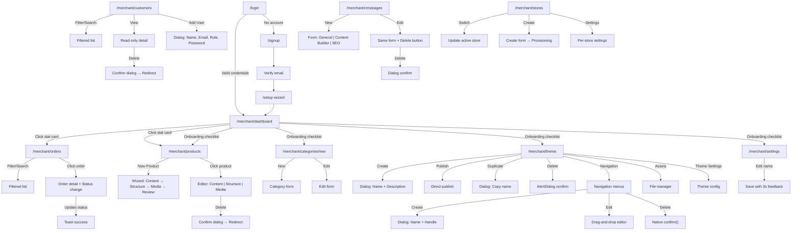

### 6.2 Order Processing Flow (As-Is vs. Ideal)

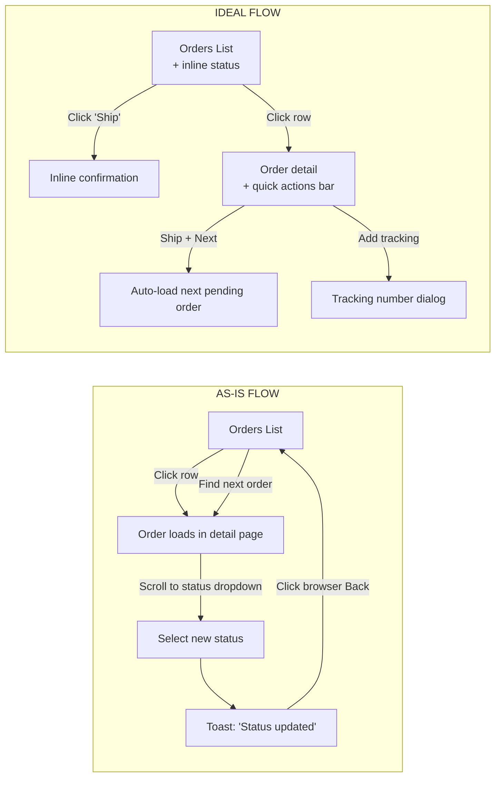

### 6.3 Product Creation Flow (As-Is vs. Ideal)

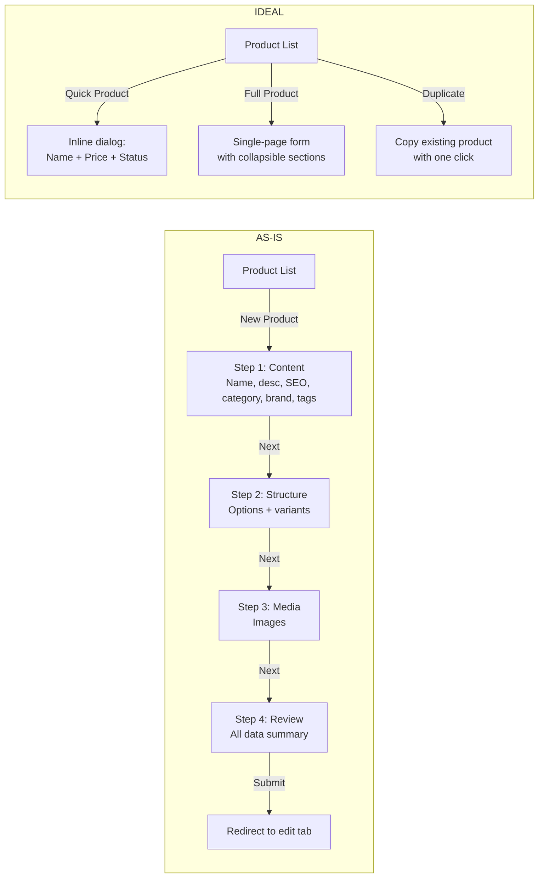

---

## Summary of Critical Findings

| Category | Count | Worst Gap |
|---|---|---|
| **Missing screens** | 20+ | Storefront has zero pages (cart, checkout, products all missing) |
| **Missing settings** | 6 | Payment, shipping, tax, email, domain, branding — all missing |
| **Missing inline actions** | 4 | No inline order status change, no inline stock edit, no bulk operations |
| **Missing confirmations** | 4 | Order status change, publish theme, switch store, logout |
| **Missing empty states** | 5 | Categories, Brands, Tags, Hero Banners list pages |
| **Inconsistent UI patterns** | 2 | Nav menu uses native `confirm()` instead of styled Dialog; Hero Banners uses wrong permission key |
| **Read-only dead ends** | 3 | Customer detail, store settings (name only), slug change requires support |

### Top 5 UX Changes That Would Deliver the Most Value

1. **Storefront pages** — Without customer-facing pages, the entire ecommerce platform generates zero revenue
2. **Payment/shipping/tax settings** — Without these, merchants can't complete real transactions
3. **Inline order status changes** — Single biggest daily efficiency gain for merchants
4. **Bulk product operations** — Import, export, duplicate, batch edit — essential for catalog management
5. **Loading/error/404 boundaries** — Every page is vulnerable to a full-screen crash with no recovery path
