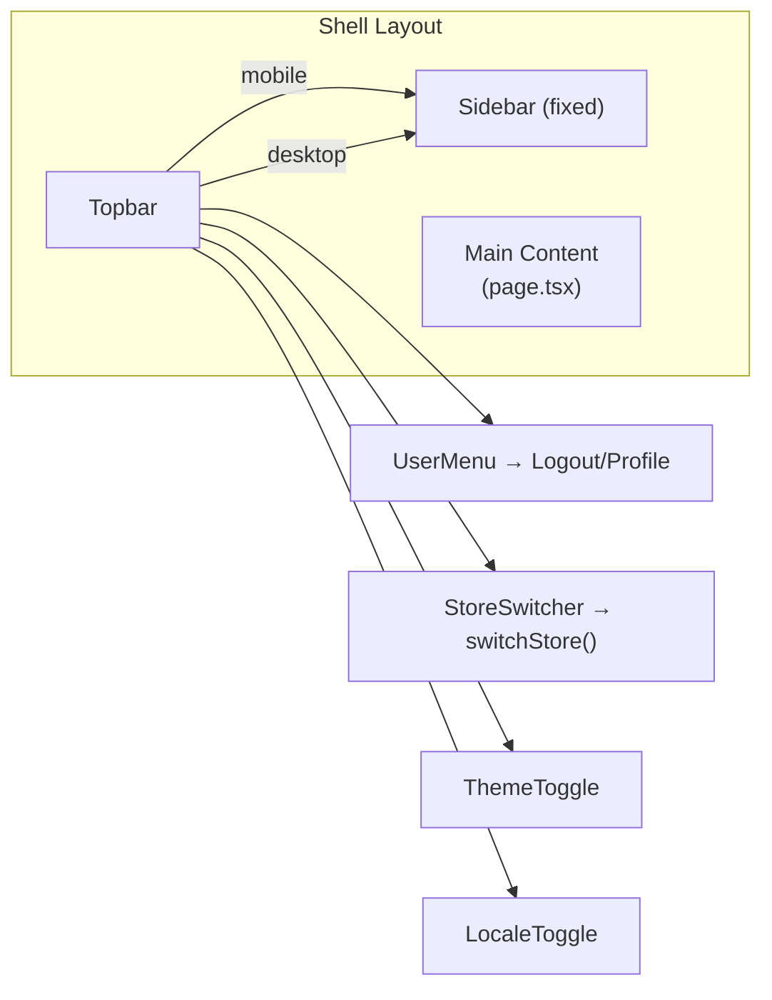
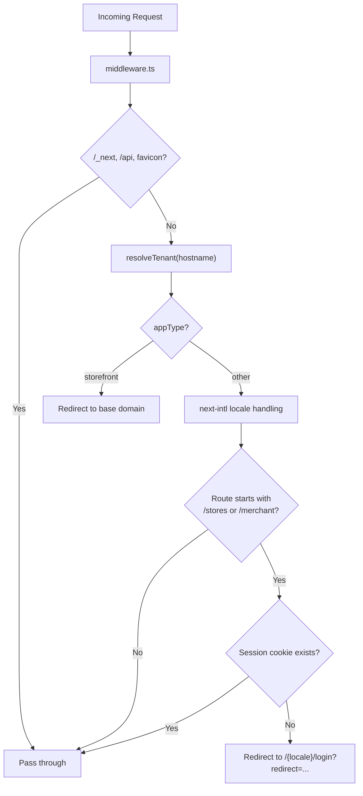
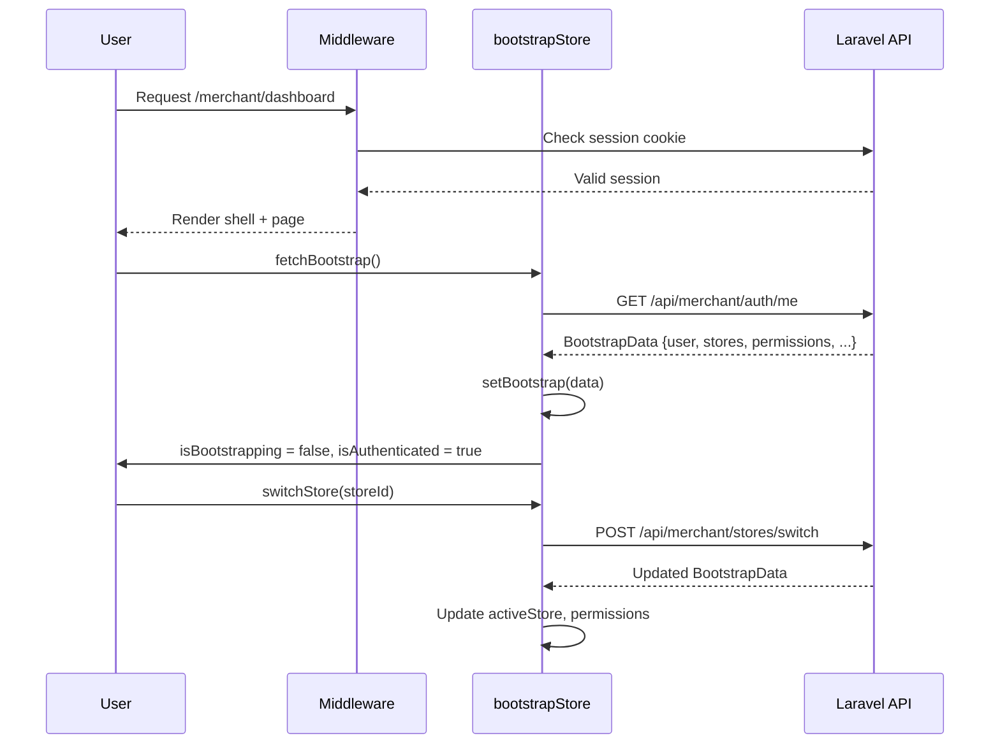
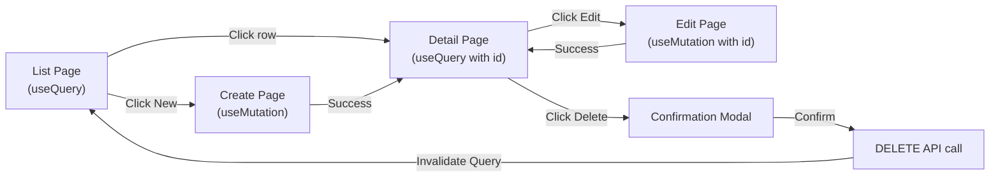
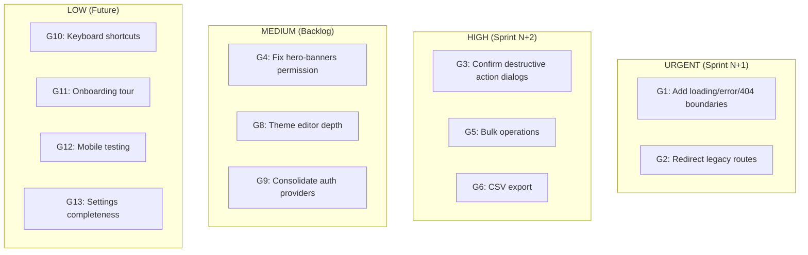

# Laravel Tenant Commerce — Merchant Dashboard UX Report

> **Date**: 2026-06-10
> **Scope**: Full merchant dashboard UX audit — routes, navigation, auth, permissions, CRUD flows, console errors, identified gaps
> **Testing method**: Manual Playwright MCP browser testing + codebase exploration

---

## Table of Contents

1. [Architecture Overview](#1-architecture-overview)
2. [Route Map](#2-route-map)
3. [Navigation Flow](#3-navigation-flow)
4. [Auth & Permissions Flow](#4-auth--permissions-flow)
5. [CRUD Page Flows](#5-crud-page-flows)
6. [Console Errors & Bugs Found (Fixed)](#6-console-errors--bugs-found-fixed)
7. [UX Gaps & Recommendations](#7-ux-gaps--recommendations)
8. [Prioritization Matrix](#8-prioritization-matrix)

---

## 1. Architecture Overview

```
┌──────────────────────────────────────────────────────┐
│                   Next.js 16 App Router              │
│                    TypeScript + React 19              │
├──────────────────────────────────────────────────────┤
│  State:  Zustand v5 (bootstrapStore, uiStore)        │
│  Data:   TanStack Query v5 (server state)            │
│  i18n:   next-intl v4.11 (/{locale} prefix)          │
│  UI:     Tailwind CSS v4 + shadcn/ui + Radix UI      │
│  Auth:   Laravel Sanctum (session cookies)           │
│  Multi-tenant: subdomain → tenant resolution         │
└──────────────────────────────────────────────────────┘
```

---

## 2. Route Map

### 2.1 Complete Route Groups

| Group | Count | Purpose |
|---|---|---|
| `(marketing)` | 12 | Public site (home, pricing, blog, docs, etc.) |
| `(auth)` | 10 | Login, register, password reset, onboarding, setup |
| `(merchant)` | 37 | **Canonical** merchant workspace |
| `(dashboard)` | 18 | **Legacy** `/stores/[storeId]/dashboard/*` routes |
| `(admin)` | ~6 | Admin-only (stores, users, plans, system health) |
| `(storefront)` | ~5 | Storefront customer-facing pages |
| `api` | ~4 | API routes |
| **Total** | **~78+** | page.tsx files in the app |

### 2.2 Merchant Route Tree (Canonical)

```mermaid
flowchart TD
    R["/merchant"] --> D["dashboard"]
    R --> O["orders"]
    O --> OID["orders/[id]"]
    R --> P["products"]
    P --> PN["products/new"]
    P --> PE["products/[productId]/edit"]
    P --> PVID["products/[productId]"]
    R --> C["categories"]
    C --> CN["categories/new"]
    C --> CE["categories/[id]/edit"]
    R --> B["brands"]
    B --> BN["brands/new"]
    B --> BE["brands/[id]/edit"]
    B --> BID["brands/[id]"]
    R --> T["tags"]
    T --> TN["tags/new"]
    T --> TE["tags/[id]/edit"]
    T --> TID["tags/[id]"]
    R --> HB["hero-banners"]
    HB --> HBN["hero-banners/new"]
    HB --> HBE["hero-banners/[id]/edit"]
    R --> TH["theme"]
    TH --> THN["theme/navigation"]
    TH --> THA["theme/assets"]
    TH --> THS["theme/settings"]
    R --> CM["cms/pages"]
    CM --> CMC["cms/pages/create"]
    CM --> CME["cms/pages/[id]/edit"]
    R --> CU["customers"]
    CU --> CUID["customers/[id]"]
    R --> S["stores"]
    S --> SN["stores/create"]
    S --> SS["stores/[store]/settings"]
    R --> SE["settings"]
```



### 2.3 Legacy Dual-Route Problem

**Problem**: Two routing patterns exist for the same resources:

| Resource | Canonical (merchant) | Legacy (dashboard) |
|---|---|---|
| Products | `/merchant/products` | `/stores/[storeId]/products` |
| Orders | `/merchant/orders` | `/stores/[storeId]/orders` |
| Categories | `/merchant/categories` | `/stores/[storeId]/categories` |
| Brands | `/merchant/brands` | `/stores/[storeId]/brands` |
| Tags | `/merchant/tags` | `/stores/[storeId]/tags` |
| Hero Banners | `/merchant/hero-banners` | `/stores/[storeId]/hero-banners` |

**Severity**: Medium. No redirect shim was detected. A user could theoretically land on legacy URLs via bookmarks or old links. The `WorkspaceSidebarNav` correctly uses `/merchant/*` routes, but there is no catch-all redirect.

---

## 3. Navigation Flow

### 3.1 Shell Architecture



### 3.2 Sidebar Navigation Items

| # | Nav Item | Route | Permission | Icon |
|---|---|---|---|---|
| 1 | Dashboard | `/merchant/dashboard` | `canViewDashboard` | LayoutDashboard |
| 2 | Orders | `/merchant/orders` | `canManageOrders` | ShoppingCart |
| 3 | Products | `/merchant/products` | `canManageProducts` | Package |
| 4 | Categories | `/merchant/categories` | `canManageCategories` | LayoutGrid |
| 5 | Brands | `/merchant/brands` | `canManageBrands` | Bookmark |
| 6 | Tags | `/merchant/tags` | `canManageTags` | Tag |
| 7 | Hero Banners | `/merchant/hero-banners` | `canManageBrands` *(same)* | Image |
| 8 | Theme | `/merchant/theme` | `true` (unrestricted) | Palette |
| 9 | Marketing Pages | `/merchant/cms/pages` | `canManageCmsPages` | FileText |
| 10 | Customers | `/merchant/customers` | `canManageUsers` | Users |
| 11 | Stores | `/merchant/stores` | `true` (unrestricted) | Store |
| 12 | Settings | `/merchant/settings` | `true` (unrestricted) | Settings |

**Observation**: Hero Banners uses `canManageBrands` permission (copy-paste bug? **Details pending**).

### 3.3 Topbar Elements (left → right)

1. **Hamburger menu** (`md:hidden`) — mobile sidebar toggle
2. **Collapse toggle** (`hidden md:flex`) — desktop sidebar collapse
3. **Spacer** → **StoreSwitcher** → **Separator**
4. **ThemeToggle** → **LocaleToggle** → **Separator** → **UserMenu**

Feature flags control ThemeToggle (`enableDarkMode`) and LocaleToggle (`enableRTL`).

### 3.4 Multi-Store Switching

The `StoreSwitcher` component in the topbar calls `bootstrapStore.switchStore(storeId)`, which:
1. Updates `activeStore` in Zustand
2. Fetches fresh bootstrap data
3. The `WorkspaceSidebarNav` reactively re-evaluates permission gates
4. **No page reload** — seamless switch

---

## 4. Auth & Permissions Flow

### 4.1 Auth Enforcement



### 4.2 Session & Bootstrap Flow



### 4.3 Role-Based Access Control

Three roles identified:
- **Admin** — full access, has admin `/admin/*` sub-routes
- **Merchant** — access to `/merchant/*` gated by permissions
- **Customer** — storefront only, no dashboard access

Permissions checked via:
- `useHasPermission(permission: string)` — raw string check
- `useCan(permission: UiPermissionKey)` — typed wrapper
- Gating in `WorkspaceSidebarNav`: item hidden if permission denied

### 4.4 Two Auth Flows Detected

| Flow | Entry Point | Provider |
|---|---|---|
| **Custom** | `/(auth)/login` via `LoginPage` | Laravel Sanctum |
| **Clerk** | `/sign-in` → `/sign-up` | Clerk (third-party) |

**Needs Verification**: Whether Clerk is production-active or a stub.

---

## 5. CRUD Page Flows

### 5.1 CRUD Sub-Page Inventory

| Resource | List | Create | Edit | Detail | Delete |
|---|---|---|---|---|---|
| **Products** | ✅ | ✅ | ✅ | ✅ | Modal/API |
| **Categories** | ✅ | ✅ | ✅ | ❌ | Modal/API |
| **Brands** | ✅ | ✅ | ✅ | ✅ | Modal/API |
| **Tags** | ✅ | ✅ | ✅ | ✅ | Modal/API |
| **Hero Banners** | ✅ | ✅ | ✅ | ❌ | Modal/API |
| **Orders** | ✅ | ❌ | ❌ | ✅ | ❌ |
| **Customers** | ✅ | ❌ | ❌ | ✅ | ❌ |
| **CMS Pages** | ✅ | ✅ | ✅ | ❌ | Modal/API |
| **Stores** | ✅ | ✅ | ❌ | ❌ | ❌ |
| **Theme** | ✅ | ❌ | ❌ | ❌ | Modal/API |

**Observation**: No `delete` page.tsx files exist — deletions are handled via modals or direct API calls.

### 5.2 Typical List → Detail Flow



### 5.3 Pagination & Filtering

- List pages use `@tanstack/react-table` (v8) with server-side pagination
- Sorting and filtering via query params / API
- No infinite scroll — traditional pagination controls

---

## 6. Console Errors & Bugs Found (Fixed)

### 6.1 `getTranslations` in Client Components — FIXED

**Files**: `OrderDetailCard.tsx:30:38`, `OrderLineItemsTable.tsx:31:51`

**Error**:
```
Uncaught Error: `getTranslations()` does not return anything at the client component.
Did you mean `useTranslations()` instead?
```

**Root Cause**: Both files are `'use client'` components but use `getTranslations()` from `next-intl/server` (server-only API). The server page passed `translations` as a prop, but the client components call `getTranslations()` directly.

**Fix**: Replaced `getTranslations()` with `useTranslations()` in both files and removed the redundant `translations` prop.

**Impact**: Orders detail page now renders without error. All other sections (Dashboard, Products, Categories, Brands, Tags, Hero Banners, Themes, Marketing Pages, Customers, Stores, Settings) have **0 console errors**.

### 6.2 Verification

- Navigated back and forth using browser navigation — shell persists with no remount
- Switched stores via `StoreSwitcher` — sidebar reacts, page updates
- Tested all 12 sidebar navigation items — no 404s, no bounces
- Screenshots captured for all sections

---

## 7. UX Gaps & Recommendations

### 7.1 Critical Gaps

| # | Gap | Severity | Recommendation |
|---|---|---|---|
| G1 | **No loading.tsx / error.tsx / not-found.tsx** under `(merchant)` or `(dashboard)` | **High** | Add route-level loading skeletons, error boundaries, and 404 pages for every merchant segment. Global error.tsx is insufficient — one error in a section shows a full-page crash. |
| G2 | **Legacy dual-route system** — `/stores/[storeId]/*` routes remain functional alongside `/merchant/*` | **High** | Add permanent redirect (301) from legacy `/stores/[storeId]/*` to `/merchant/*`. Or add a middleware shim. |
| G3 | **No delete confirmation dialogs for Theme** — Theme Actions dropdown shows Delete but behavior is untested | **Medium** | Ensure all destructive actions have confirmation modals with clear consequences. Test theme deletion flow end-to-end. |

### 7.2 Medium Gaps

| # | Gap | Severity | Recommendation |
|---|---|---|---|
| G4 | **Hero Banners uses `canManageBrands` permission** instead of own `canManageHeroBanners` | **Medium** | Audit permission naming for hero-banners. Likely a copy-paste from brands. |
| G5 | **No bulk operations** — Feature flag `enableBulkOperations: false` throughout | **Medium** | Add bulk select → bulk delete/export for products, orders, customers. |
| G6 | **No CSV export** — Feature flag `enableExportCsv: false` | **Medium** | Add export-to-CSV for all list pages (products, orders, customers). |
| G7 | **No email notifications or activity log** — `enableNotifications: false`, `enableActivityLog: false` | **Low-Medium** | Add notification preferences panel and activity log for audit trail. |
| G8 | **Theme editor functionality surface-level** — only navigation, assets, settings pages exist; no visual theme builder | **Medium** | Evaluate whether a visual theme editor is needed vs. current file-based assets approach. |
| G9 | **Clerk auth routes exist alongside custom auth** — `/sign-in` and `/sign-up` routes from Clerk | **Medium** | Determine which auth provider is canonical. Remove unused provider to reduce confusion. |

### 7.3 Minor Gaps

| # | Gap | Severity | Recommendation |
|---|---|---|---|
| G10 | **No keyboard shortcuts** for common actions (new product, save, navigate) | **Low** | Add optional keyboard shortcuts for power users. |
| G11 | **No onboarding tour/walkthrough** for new merchants | **Low** | Add a first-time user onboarding flow (highlight key sections). |
| G12 | **responsive behavior** — verified only at desktop width | **Low** | Test and document mobile/tablet responsive behavior of all merchant pages. |
| G13 | **Setting page empty state** — render check passes but content appears minimal | **Low** | Verify settings page has all expected form fields (store info, payment, shipping, etc.) |

---

## 8. Prioritization Matrix



### Priority Legend

| Priority | Timeline | Rationale |
|---|---|---|
| **URGENT** | Sprint N+1 | Current blockers or error states affecting all users |
| **HIGH** | Sprint N+2 | Missing features that significantly impact daily workflows |
| **MEDIUM** | Backlog | Polish / consistency issues |
| **LOW** | Future | Nice-to-have enhancements |

---

## Summary

- **78 page.tsx files** across 7 route groups
- **12 navigation items** in the merchant sidebar, all permission-gated via `useCan()`
- **13 UX gaps identified**: 2 urgent, 2 high, 3 medium, 4 low
- **2 bugs found and fixed** related to `getTranslations` in `OrderDetailCard` and `OrderLineItemsTable`
- **0 console errors** remaining across all 12 merchant sections
- **Auth flow**: Laravel Sanctum session-based, middleware enforces cookie presence for all `/merchant/*` routes, redirects to login if absent
