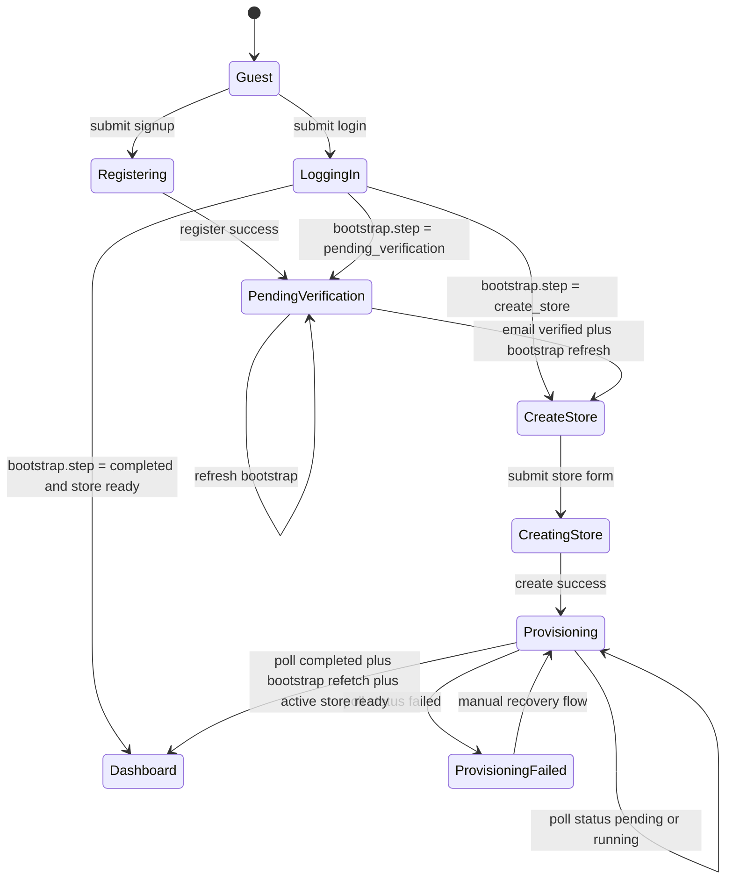

# Dashboard Frontend Auth, Onboarding, and Store Lifecycle Guide

This document is the canonical frontend integration contract for the Dashboard application.

Audience:

- Frontend engineers
- Frontend AI agents
- Dashboard app implementers
- React, Zustand, and TanStack Query maintainers

This guide is intentionally frontend-first. It documents the verified live API contracts and route/state behavior needed to implement:

- signup
- login
- onboarding restoration
- first-store creation
- provisioning polling
- dashboard bootstrap
- sidebar rendering
- store switching
- logout
- route protection

Non-goals:

- Laravel architecture explanation
- backend implementation audit
- repository/action pattern explanation
- domain-driven design discussion

This guide is based only on the current live routes, middleware, resources, serializers, models, and frontend-critical tests.

---

## 1. Dashboard Authentication Architecture

### Auth Model

The Dashboard uses cookie/session authentication with Sanctum.

- Protected Dashboard APIs use `auth:sanctum`.
- The application is configured for stateful SPA auth.
- CORS supports credentials.
- The normal Dashboard contract is browser cookies plus CSRF, not a custom bearer-token flow.

### CSRF Flow

For browser-based first-party Dashboard clients, fetch a CSRF cookie before the first state-changing request.

Canonical API endpoint:

- `GET /api/sanctum/csrf-cookie`

Also available on the web surface:

- `GET /sanctum/csrf-cookie`

Verified API behavior:

- returns `204 No Content`
- sets CSRF/session cookies
- adds these response headers:
  - `X-Session-Auth-Domain`
  - `X-Session-Route-Domain`
  - `X-Future-Guard-Hint`

Recommended frontend rule:

1. App starts or login/register form mounts.
2. Call `GET /api/sanctum/csrf-cookie` with credentials included.
3. Then call login/register/logout/store mutations.

### Bootstrap-First Architecture

The Dashboard should be implemented around `GET /api/v1/me`.

Why `GET /api/v1/me` is canonical:

- It is the canonical Dashboard bootstrap route.
- It returns all frontend-critical auth and dashboard state in one payload.
- It is enough to resolve:
  - authenticated vs guest
  - verified vs unverified
  - onboarding step
  - store list
  - active store
  - active-store permissions
  - feature flags
  - localization/config defaults
  - session metadata

Frontend rule:

- Login and register responses are transport responses.
- `GET /api/v1/me` is the source of truth for app state.
- After login, register, logout, provisioning completion, or auth recovery, resolve UI state from bootstrap.

### Active Store Concept

The Dashboard is active-store aware.

- `stores` is the full accessible store list.
- `active_store` is the resolved current store object.
- `active_store_id` mirrors `active_store?.id`.
- Root `permissions` are resolved for the active store.
- Each item in `stores[]` also includes store-specific `permissions`.

Active store resolution behavior:

- use `last_active_store_id` if that store is still accessible
- otherwise fall back to the first accessible store
- otherwise `active_store` is `null`

### Onboarding Lifecycle Overview

Verified merchant onboarding steps:

- `pending_verification`
- `create_store`
- `store_creation_in_progress`
- `store_created`
- `store_configured`
- `completed`

Frontend implications:

- `pending_verification`: authenticated, but not dashboard-ready
- `create_store`: verified merchant, no store yet, show create-store onboarding
- `store_creation_in_progress`: creation already started, keep user in locked onboarding/provisioning flow
- `completed`: onboarding is complete, but store readiness still depends on store lifecycle

Important distinction:

- onboarding completion does not guarantee store readiness
- a user can be `completed` while the first store is still `pending_setup` or `provisioning`

---

## 2. Canonical API Endpoints

### Common Response Envelope

Success envelope:

```json
{
  "success": true,
  "message": "Localized message",
  "data": {},
  "meta": {}
}
```

Error envelope:

```json
{
  "success": false,
  "code": "VAL_001",
  "message": "Validation failed.",
  "errors": {
    "field": [
      "Problem message"
    ]
  }
}
```

Some forbidden responses also include:

```json
{
  "redirect": "/dashboard"
}
```

### Endpoint Summary

| Method | URL | Auth | Purpose |
| --- | --- | --- | --- |
| `POST` | `/api/v1/users/auth/register` | Guest | Create merchant account and authenticated session |
| `POST` | `/api/v1/users/auth/login` | Guest | Login and create merchant session |
| `POST` | `/api/v1/users/auth/logout` | Authenticated | End current session |
| `GET` | `/api/v1/me` | Authenticated | Canonical Dashboard bootstrap |
| `POST` | `/api/v1/stores` | Authenticated + verified | Create first or additional store |
| `GET` | `/api/v1/stores/{store}/provisioning-status` | Authenticated + verified + authorized | Poll provisioning progress |
| `PATCH` | `/api/v1/users/auth/active-store` | Authenticated + verified | Switch active store and receive refreshed bootstrap |

### `POST /api/v1/users/auth/register`

- Auth: guest
- CSRF: yes for browser SPA
- Success status: `201`
- Purpose: create merchant account and sign the user in

Request payload:

```json
{
  "name": "John Merchant",
  "email": "john@example.com",
  "password": "password123",
  "password_confirmation": "password123"
}
```

Validated fields:

- `name`: required string max 255
- `email`: required unique valid email
- `password`: required, confirmed, Laravel password defaults

Success response example:

```json
{
  "success": true,
  "message": "Registration successful. Please verify your email.",
  "data": {
    "id": 1,
    "name": "John Merchant",
    "email": "john@example.com",
    "phone": null,
    "avatar": null,
    "email_verified_at": null,
    "onboarding_step": "pending_verification",
    "has_password": true,
    "has_google_linked": false,
    "created_at": "2026-05-24T08:00:00+00:00",
    "updated_at": "2026-05-24T08:00:00+00:00"
  },
  "meta": {
    "session": {
      "id": "session-id",
      "ip_address": "127.0.0.1",
      "user_agent": "Mozilla/5.0",
      "last_active_at": "2026-05-24T08:00:00+00:00",
      "is_current": true,
      "auth_domain": "merchant",
      "actor_type": "merchant",
      "route_domain": "merchant_users",
      "onboarding_applicable": true,
      "future_guard_hint": "merchant_guard"
    }
  }
}
```

Error shape:

- validation: `422`, `code: "VAL_001"`
- duplicate email: `422`, field error under `errors.email`

Frontend usage:

- treat success as authenticated
- do not unlock the dashboard from this response alone
- immediately resolve canonical state via `GET /api/v1/me`
- expect bootstrap to report `pending_verification`

Redirect behavior:

- backend does not redirect
- frontend should send the user to verification-required onboarding UI

Retry behavior:

- no automatic retry
- allow manual retry only after network failure

Optimistic update rules:

- none

Caching recommendations:

- do not cache mutation response as canonical app state
- invalidate bootstrap query on success

### `POST /api/v1/users/auth/login`

- Auth: guest
- CSRF: yes for browser SPA
- Success status: `200`
- Purpose: create authenticated merchant session

Request payload:

```json
{
  "email": "john@example.com",
  "password": "password123"
}
```

Success response example:

```json
{
  "success": true,
  "message": "Login successful.",
  "data": {
    "user": {
      "id": 1,
      "name": "John Merchant",
      "email": "john@example.com",
      "phone": null,
      "avatar": null,
      "email_verified_at": "2026-05-24T08:05:00+00:00",
      "onboarding_step": "create_store",
      "has_password": true,
      "has_google_linked": false,
      "created_at": "2026-05-24T08:00:00+00:00",
      "updated_at": "2026-05-24T08:05:00+00:00"
    }
  },
  "meta": {
    "session": {
      "id": "session-id",
      "ip_address": "127.0.0.1",
      "user_agent": "Mozilla/5.0",
      "last_active_at": "2026-05-24T08:05:00+00:00",
      "is_current": true,
      "auth_domain": "merchant",
      "actor_type": "merchant",
      "route_domain": "merchant_users",
      "onboarding_applicable": true,
      "future_guard_hint": "merchant_guard"
    }
  }
}
```

Error shape:

- invalid credentials: `401`, `code: "AUTH_001"`
- disabled account: `403`, `code: "AUTH_002"`
- rate limit: `429`, `code: "AUTH_008"`
- validation: `422`, `code: "VAL_001"`

Frontend usage:

- treat success as session creation only
- immediately fetch `GET /api/v1/me`
- route from bootstrap, not from login response alone

Redirect behavior:

- no backend redirect on success
- frontend redirects based on bootstrap

Retry behavior:

- do not auto-retry invalid credentials
- allow manual retry
- show cooldown UI for `429`

Optimistic update rules:

- none

Caching recommendations:

- invalidate bootstrap query on success

### `POST /api/v1/users/auth/logout`

- Auth: authenticated
- CSRF: yes for browser SPA
- Success status: `200`
- Purpose: end current dashboard session

Request payload:

```json
{}
```

Success response example:

```json
{
  "success": true,
  "message": "Logged out successfully.",
  "data": null,
  "meta": {
    "session": {
      "id": "session-id",
      "ip_address": "127.0.0.1",
      "user_agent": "Mozilla/5.0",
      "last_active_at": "2026-05-24T08:10:00+00:00",
      "is_current": true,
      "auth_domain": "merchant",
      "actor_type": "merchant",
      "route_domain": "merchant_users",
      "onboarding_applicable": true,
      "future_guard_hint": "merchant_guard"
    }
  }
}
```

Verified follow-up behavior:

- after logout, `GET /api/v1/me` returns `401`

Frontend usage:

- clear all dashboard state on success
- cancel polling
- remove bootstrap cache
- navigate to guest route

Redirect behavior:

- frontend-controlled

Retry behavior:

- usually none needed
- if uncertain whether logout completed, recover with `GET /api/v1/me`

Optimistic update rules:

- safe to clear local state after confirmed success

Caching recommendations:

- clear bootstrap and store-scoped queries on success

### `GET /api/v1/me`

- Auth: authenticated
- Success status: `200`
- Purpose: canonical Dashboard bootstrap payload

Response payload:

- see Section 3 for full field breakdown

Error shape:

- unauthenticated: `401`, `code: "AUTH_002"`

Frontend usage:

- app initialization
- route protection
- onboarding restoration
- sidebar permission hydration
- active store resolution
- auth recovery after refresh

Redirect behavior:

- no backend redirect on success
- frontend chooses route from bootstrap state

Retry behavior:

- bounded automatic retry on transient network failure is reasonable
- do not retry `401` endlessly

Optimistic update rules:

- none, this is authoritative state

Caching recommendations:

- use one canonical query key, for example `['bootstrap', 'me']`
- keep `staleTime` short or `0`
- invalidate after auth or store-context mutations

### `POST /api/v1/stores`

- Auth: authenticated and verified
- Success status: `201`
- Purpose: create first store or additional store

Request payload:

```json
{
  "name": "My First Store",
  "slug": "my-first-store"
}
```

Validated fields:

- `name`: required string max 255
- `slug`: required unique slug, lowercase letters/numbers/hyphens only, reserved-word protected

Success response example:

```json
{
  "success": true,
  "message": "Store created successfully",
  "data": {
    "id": 10,
    "name": "My First Store",
    "slug": "my-first-store",
    "status": "pending_setup",
    "is_active": false,
    "status_changed_at": "2026-05-24T08:15:00+00:00",
    "created_at": "2026-05-24T08:15:00+00:00",
    "domain": null,
    "currency": "USD",
    "timezone": "UTC"
  }
}
```

Verified lifecycle effects:

- onboarding moves to `completed`
- `last_active_store_id` is set to the new store
- the store starts non-operational
- async provisioning begins after commit through the store-created event listener

Error shape:

- validation: `422`, `code: "VAL_001"`
- duplicate slug: `errors.slug`
- duplicate/in-flight first-store submission: `errors.store`
- unverified account: `403` from verified middleware

Frontend usage:

- lock the form while pending
- after success, move into provisioning UI
- start provisioning polling with returned `data.id`
- refresh bootstrap

Redirect behavior:

- no backend redirect on success
- frontend should transition to provisioning flow

Retry behavior:

- manual retry only
- do not blindly retry the create mutation

Optimistic update rules:

- do not optimistically unlock dashboard routes
- do not assume the store is usable until provisioning completes and bootstrap confirms readiness

Caching recommendations:

- invalidate bootstrap on success
- seed provisioning query from returned store id

### `GET /api/v1/stores/{store}/provisioning-status`

- Auth: authenticated, verified, and authorized for that store
- Success status: `200`
- Purpose: poll async provisioning progress

Success response example:

```json
{
  "success": true,
  "message": "success",
  "data": {
    "status": "running",
    "progress": 45,
    "current_step": "setting_up_database",
    "message": "Creating database tables...",
    "retryable": false
  }
}
```

Verified alternate running example:

```json
{
  "success": true,
  "data": {
    "status": "running",
    "progress": 50,
    "current_step": "creating_database",
    "message": "Setting up your store database",
    "retryable": false
  }
}
```

Error shape:

- wrong store access: `403`, `code: "STORE_ACCESS_DENIED"`, `redirect: "/dashboard"`
- store missing: `404`, `code: "STR_001"`

Frontend usage:

- poll after first-store creation
- gate dashboard access while provisioning is not terminal-success
- on `completed`, stop polling and refresh bootstrap

Redirect behavior:

- on `403` with `redirect`, return to dashboard root and refresh bootstrap

Retry behavior:

- automatic retry is appropriate as part of polling behavior
- stop polling on terminal states

Optimistic update rules:

- none

Caching recommendations:

- use a per-store query key, for example `['provisioning-status', storeId]`
- prefer polling over stale cached reads

### `PATCH /api/v1/users/auth/active-store`

- Auth: authenticated and verified
- Success status: `200`
- Purpose: switch active Dashboard store

Request payload:

```json
{
  "store_id": 20
}
```

Success behavior:

- response contains refreshed bootstrap payload
- `data.active_store_id` updates immediately
- database `last_active_store_id` persists
- `meta.session` is included

Minimal response shape example:

```json
{
  "success": true,
  "message": "Active store updated successfully.",
  "data": {
    "active_store_id": 20
  },
  "meta": {
    "session": {
      "actor_type": "merchant"
    }
  }
}
```

Frontend usage:

- use this as the canonical store switch mutation
- replace bootstrap state from the mutation response
- invalidate store-scoped queries after success

Redirect behavior:

- none on success
- on forbidden switch, return to a safe dashboard route and refresh bootstrap

Retry behavior:

- no automatic retry
- if the result is uncertain, recover via `GET /api/v1/me`

Optimistic update rules:

- avoid optimistic permission/sidebar switching
- safer pattern: pending UI, commit on response

Caching recommendations:

- replace or invalidate bootstrap query
- invalidate active-store-scoped queries

---

## 3. Bootstrap Payload Deep Explanation

### Canonical Shape

```json
{
  "success": true,
  "message": "Bootstrap loaded successfully.",
  "data": {
    "user": {
      "id": 7,
      "name": "Northwind Merchant",
      "email": "merchant@example.com",
      "avatar_url": null,
      "is_email_verified": true,
      "email_verified_at": "2026-05-24T08:20:42+00:00"
    },
    "email_verified": true,
    "stores": [
      {
        "id": 11,
        "name": "Northwind Store",
        "slug": "northwind-store",
        "domain": "northwind.test",
        "currency": "USD",
        "role": "store_admin",
        "status": "active",
        "is_active": true,
        "status_changed_at": null,
        "created_at": "2026-05-24T08:20:42+00:00",
        "permissions": [
          "product.view"
        ]
      }
    ],
    "active_store": {
      "id": 11,
      "name": "Northwind Store",
      "slug": "northwind-store",
      "domain": "northwind.test",
      "currency": "USD",
      "role": "store_admin",
      "status": "active",
      "is_active": true,
      "status_changed_at": null,
      "created_at": "2026-05-24T08:20:42+00:00",
      "permissions": [
        "product.view"
      ]
    },
    "active_store_id": 11,
    "onboarding": {
      "step": "completed",
      "completed_steps": [
        "pending_verification",
        "create_store",
        "store_creation_in_progress",
        "store_created",
        "store_configured"
      ],
      "can_resume": true,
      "store_id": "11",
      "is_completed": true
    },
    "permissions": [
      "product.view"
    ],
    "capabilities": [],
    "session": {
      "id": "session-id",
      "ip_address": "127.0.0.1",
      "user_agent": "Symfony",
      "last_active_at": "2026-05-24T08:20:42+00:00",
      "is_current": true,
      "auth_domain": "merchant",
      "actor_type": "merchant",
      "route_domain": "merchant_users",
      "onboarding_applicable": true,
      "future_guard_hint": "merchant_guard"
    },
    "features": {
      "bootstrap.v2.enabled": false,
      "bootstrap.shadow_read": false,
      "platform.authority.enabled": true
    },
    "config": {
      "supported_locales": [
        "en",
        "ar"
      ],
      "default_currency": "USD",
      "timezone": "UTC"
    },
    "localization": {
      "supported_locales": [
        "en",
        "ar"
      ],
      "default_currency": "USD",
      "timezone": "UTC"
    },
    "actor_context": "merchant"
  },
  "meta": {
    "session": {
      "id": "session-id",
      "ip_address": "127.0.0.1",
      "user_agent": "Symfony",
      "last_active_at": "2026-05-24T08:20:42+00:00",
      "is_current": true,
      "auth_domain": "merchant",
      "actor_type": "merchant",
      "route_domain": "merchant_users",
      "onboarding_applicable": true,
      "future_guard_hint": "merchant_guard"
    }
  }
}
```

Notes:

- `message` is localized and must not drive control flow.
- `features` contains many booleans; only a subset is shown above for readability.
- `capabilities` is currently an empty array in the live runtime and should not be used as the source of permission truth.

### `user`

Use for shell identity and account state.

Fields:

- `id`
- `name`
- `email`
- `avatar_url`
- `is_email_verified`
- `email_verified_at`

Nullable behavior:

- `avatar_url` can be `null`
- `email_verified_at` can be `null`

### `stores`

The full accessible store list for the current dashboard user.

Each store includes:

- `id`
- `name`
- `slug`
- `domain`
- `currency`
- `role`
- `status`
- `is_active`
- `status_changed_at`
- `created_at`
- `permissions`

Frontend rules:

- render store switcher options from `stores`
- use `status` and `is_active` to detect blocked or pre-active stores
- do not assume the first store is active; use `active_store_id`

### `active_store`

The fully hydrated active store object.

Behavior:

- nullable when the user has no accessible stores
- mirrors one of the `stores` entries when present
- use it for page shell, store badge, active permissions, and store-aware queries

### `onboarding`

Primary route-guard input.

Fields:

- `step`
- `completed_steps`
- `can_resume`
- `store_id`
- `is_completed`

Frontend rules:

- `step` and `is_completed` are authoritative
- treat `can_resume` as helpful UX metadata, not the primary state-machine field
- `store_id` can be `null` or a string

### `permissions`

Root `permissions` is the active-store-scoped permission array.

Examples:

- `product.view`
- `product.update`
- `store.update`

Use this for:

- sidebar rendering
- page gating
- feature visibility

### `capabilities`

Current live runtime behavior:

```json
[]
```

Important frontend rule:

- do not build new Dashboard logic on `capabilities`
- use `permissions` instead

Legacy note:

- some older tests still expect a boolean capability object
- that is not the frontend-safe canonical runtime contract today

### `features`

A boolean feature-flag object keyed by config flag name.

Frontend rules:

- treat as server-driven feature toggles
- do not assume a fixed key set forever

### `localization`

Current display defaults:

- `supported_locales`
- `default_currency`
- `timezone`

### `config`

Current payload duplicates the same values under `config`.

Recommended frontend behavior:

- normalize `config` and `localization` into one internal selector
- do not create divergent logic for both

### `actor_context`

For the Dashboard merchant surface, verified values are:

- `merchant`
- `super_admin`

Frontend rule:

- use this for broad shell decisions only
- still derive permissions from `permissions`, not from role assumptions

### `session`

Session metadata appears in both `data.session` and `meta.session`.

Fields:

- `id`
- `ip_address`
- `user_agent`
- `last_active_at`
- `is_current`
- `auth_domain`
- `actor_type`
- `route_domain`
- `onboarding_applicable`
- `future_guard_hint`

Frontend uses:

- debug tooling
- session/account UI
- telemetry-aware shell behavior if needed

### First Login Behavior

After successful registration:

- user is authenticated
- `user.is_email_verified` is `false`
- `email_verified` is `false`
- `onboarding.step` is `pending_verification`
- `stores` is empty
- `active_store` is `null`
- `active_store_id` is `null`

Verified example:

```json
{
  "data": {
    "email_verified": false,
    "stores": [],
    "active_store": null,
    "active_store_id": null,
    "onboarding": {
      "step": "pending_verification",
      "completed_steps": [],
      "can_resume": true,
      "store_id": null,
      "is_completed": false
    }
  }
}
```

### First-Store Behavior

Before store creation, a verified merchant can look like this:

```json
{
  "data": {
    "stores": [],
    "active_store": null,
    "active_store_id": null,
    "onboarding": {
      "step": "create_store",
      "store_id": null,
      "can_resume": true,
      "is_completed": false
    },
    "permissions": []
  }
}
```

Immediately after `POST /api/v1/stores` succeeds:

- the store is returned as `pending_setup`
- `is_active` is `false`
- onboarding is already advanced to `completed`
- frontend should enter provisioning UI, not full dashboard UI

### No-Store Behavior

Verified no-store merchant behavior:

```json
{
  "data": {
    "stores": [],
    "active_store": null,
    "active_store_id": null,
    "permissions": [],
    "onboarding": {
      "step": "create_store",
      "is_completed": false
    },
    "actor_context": "merchant"
  }
}
```

### Provisioning Behavior

A store may exist in bootstrap while not yet dashboard-usable.

Relevant statuses:

- `pending_setup`
- `provisioning`
- `active`
- `disabled`
- `suspended`
- `archived`
- `deleted_pending`

Frontend-safe rule:

- only treat `status === "active"` and `is_active === true` as dashboard-ready

### Suspended and Disabled Behavior

Verified facts:

- disabled store route access can return `403`, `code: "STR_002"`, message `"Store is disabled"`
- missing store route access can return `404`, `code: "STR_001"`, message `"Store not found"`
- store switching policy requires the target store to be active

Frontend-safe rule:

- treat any non-`active` store as blocked for normal dashboard routes

---

## 4. Recommended Frontend App Lifecycle

### Exact Initialization Sequence

```text
App start
  -> initialize HTTP client
  -> ensure CSRF cookie if needed
  -> fetch bootstrap (/api/v1/me)
  -> if 401: render guest routes
  -> if authenticated:
       -> inspect actor_context
       -> inspect onboarding
       -> inspect stores / active_store
       -> inspect active_store.status and is_active
       -> hydrate permissions
       -> render onboarding, provisioning, blocked-state, or dashboard shell
```

### Recommended Runtime Order

1. Start app shell.
2. Run bootstrap query.
3. If bootstrap is loading, show full-page shell skeleton.
4. If bootstrap returns `401`, clear auth state and route to login.
5. If bootstrap succeeds, hydrate auth/store/onboarding state.
6. Evaluate onboarding before dashboard route rendering.
7. Evaluate active store readiness before sidebar and store-scoped pages.
8. Hydrate permissions and render sidebar.
9. Render the correct route tree.

### Redirect Priority

Use this order:

1. unauthenticated
2. verification-required onboarding
3. no-store onboarding
4. provisioning wait screen
5. blocked/non-operational store state
6. normal dashboard route

### Loading and Skeleton States

Recommended UX:

- first app load: full-page dashboard skeleton
- bootstrap refetch after store switch: keep shell mounted, disable store-dependent content
- store creation submit: disable form and CTA, keep form visible
- provisioning poll: show persistent progress card, not a blank page

### Failure Handling

- network error on bootstrap:
  - allow one bounded retry
  - then show reconnect UI with retry button
- `401`:
  - clear auth state and route to login
- `403` with `redirect`:
  - redirect to the safe route and refetch bootstrap
- `422`:
  - render field errors from `errors`

### Retry Strategies

- bootstrap: one bounded retry on transient network failure
- login/register/store creation/store switch: no automatic mutation retries
- provisioning: controlled polling loop

---

## 5. Onboarding Flow

### New Account Flow

1. User submits register form.
2. Backend creates account and signs user in.
3. User starts at `pending_verification`.
4. Frontend routes to verification-required UX.
5. On refresh, bootstrap restores the same state.
6. After verification, bootstrap reports `create_store`.
7. Frontend opens first-store creation.

### No-Store Flow

When bootstrap shows:

- `onboarding.step = "create_store"`
- `stores = []`
- `active_store = null`

Render the first-store creation flow.

### Onboarding Restoration After Refresh

Never trust local-only onboarding state as the source of truth.

Always restore from bootstrap:

- refresh app
- fetch `/api/v1/me`
- route from the returned onboarding state

### Interrupted Onboarding

If the user refreshes or reopens the app mid-flow:

- `pending_verification`: reopen verification UI
- `create_store`: reopen create-store UI
- `store_creation_in_progress`: reopen locked provisioning/pending UI

### Provisioning In Progress

After store creation:

- keep the user in onboarding/provisioning UI
- poll provisioning status
- do not render the normal dashboard shell as ready

### Provisioning Failure

Verified lifecycle failure fields include:

- `status = "failed"`
- `current_step = "bootstrap_failed"`
- `message = "Store provisioning failed. Retry provisioning to continue setup."`
- `retryable = true`

Verified timeout recovery fields include:

- `current_step = "bootstrap_timed_out"`
- `message = "Store provisioning timed out. Retry provisioning to continue setup."`
- `retryable = true`

Recommended frontend UX:

- show a failure panel
- keep the user in provisioning flow
- offer refresh/retry-oriented UX
- do not route into the normal dashboard

### Successful Provisioning

When provisioning reaches terminal success:

- stop polling
- refetch bootstrap
- if the active store is now operational, unlock dashboard routes

### Dashboard Unlock

Unlock the full dashboard only when all are true:

- authenticated
- actor is valid for Dashboard
- onboarding is complete or bypassed
- `active_store` exists
- `active_store.status === "active"`
- `active_store.is_active === true`

### Markdown State Machine



---

## 6. Store Creation UX Contract

### Expected Request Payload

```json
{
  "name": "My First Store",
  "slug": "my-first-store"
}
```

### Loading States

- disable submit immediately after request starts
- keep form mounted until success or validation failure
- show inline pending state instead of replacing the full page abruptly

### Disabled Buttons

Disable create-store submit when:

- form invalid
- mutation pending
- slug availability check still unresolved

### Duplicate Submission Prevention

Verified backend behavior:

- concurrent first-store submission can return:
  - `errors.store[0] = "Store creation is already in progress."`
- repeated stale submission after a first store already exists can return:
  - `errors.store[0] = "Your first store has already been created."`

Frontend recommendation:

- hard-disable the button while pending
- prevent double-clicks locally
- if backend returns one of those store-level errors, pivot into restore/provisioning UX instead of showing a generic failure

### Provisioning Polling Strategy

Recommended default:

- first poll immediately after create success
- then every `2s` for the first minute
- then every `5s`
- after several minutes, slow to `10s` if you keep the screen open

### Timeout Recommendations

Backend stale provisioning cutoff is `10 minutes`.

Recommended frontend thresholds:

- soft timeout: `2 minutes`
- hard timeout/degraded state: `10 minutes`

At soft timeout:

- show "still working" messaging
- keep polling at a slower interval

At hard timeout:

- stop aggressive polling
- show stuck/recovery UI
- offer manual refresh and support CTA

### Retry UX

Differentiate these clearly:

- retry polling: safe
- retry store creation: unsafe unless creation definitely did not happen

If store creation already succeeded, do not resubmit `POST /api/v1/stores`.

### Success Transition

After provisioning success:

1. stop polling
2. refetch bootstrap
3. resolve active store
4. route to dashboard home

---

## 7. Provisioning Polling

### Exact Polling Contract

Endpoint:

- `GET /api/v1/stores/{store}/provisioning-status`

Response fields:

- `status`
- `progress`
- `current_step`
- `message`
- `retryable`

### Field Meaning

- `status`
  - live enum values: `pending`, `running`, `completed`, `failed`
- `progress`
  - integer progress percentage
- `current_step`
  - machine-readable lifecycle step label
- `message`
  - human-readable status text
- `retryable`
  - whether the failure can be retried safely

### Terminal States

- `completed`
- `failed`

### Non-Terminal States

- `pending`
- `running`

### Known Current Step Values

Verified runtime values include:

- `initializing_store`
- `setting_up_database`
- `creating_database`
- `bootstrap_failed`
- `bootstrap_timed_out`

Frontend rule:

- treat `current_step` as open-ended metadata, not a closed enum you hardcode forever

### Retryable Failures

Verified failure example:

```json
{
  "success": true,
  "data": {
    "status": "failed",
    "progress": 40,
    "current_step": "bootstrap_failed",
    "message": "Store provisioning failed. Retry provisioning to continue setup.",
    "retryable": true
  }
}
```

### Frontend Timeout Behavior

- if polling exceeds your soft threshold, show a waiting warning but keep polling
- if polling exceeds your hard threshold, slow/stop automatic polling and show recovery UI
- keep a manual "Check again" action

### Stale Polling Handling

The backend refreshes provisioning health before returning the DTO.

Implication:

- a stale `pending` or `running` store can be converted server-side into `failed`
- the frontend should trust the polling endpoint and not invent its own stale-state reinterpretation

---

## 8. Sidebar + Permission Rendering

### Permission Serialization

Permissions are serialized in two places:

- per store in `stores[*].permissions`
- globally for the active store in root `permissions`

Use:

- root `permissions` for current route/page/sidebar checks
- `stores[*].permissions` if the store switcher needs to preview store-specific access

### Store-Scoped Permissions

Permissions are active-store-sensitive.

Recommendations:

- render sidebar from root `permissions`
- rerender sidebar whenever bootstrap changes
- rerender after active store switch and after provisioning completion

### Super Admin Behavior

Verified backend behavior:

- super admins can bootstrap on the Dashboard surface
- bootstrap remains store-aware
- permissions still come from bootstrap payload, not from a separate frontend-only role model

Frontend rule:

- still render from bootstrap
- do not special-case solely by role name unless the payload explicitly requires it

### Recommended Permission Hooks

```ts
export const useBootstrap = () => useQuery({ queryKey: ['bootstrap', 'me'] })

export const useActiveStore = () =>
  useBootstrapStore((s) => s.bootstrap?.active_store ?? null)

export const usePermissions = () =>
  useBootstrapStore((s) => s.bootstrap?.permissions ?? [])

export const useHasPermission = (permission: string) => {
  const permissions = usePermissions()
  return permissions.includes(permission)
}
```

### Sidebar Rendering Strategy

1. bootstrap loads
2. derive `active_store`
3. derive root `permissions`
4. build sidebar model from permission selectors
5. rerender sidebar whenever bootstrap changes

Important:

- do not build new sidebar logic on `capabilities`
- use `permissions` as the canonical permission source

---

## 9. Route Protection Rules

### Guest Routes

Examples:

- login
- signup

Rule:

- if bootstrap succeeds, redirect away from guest pages

### Authenticated Routes

Rule:

- if `/api/v1/me` returns `401`, redirect to login and clear state

### Onboarding-Required Routes

If bootstrap shows any onboarding step other than `completed`, block normal dashboard routes.

Recommended mapping:

- `pending_verification` -> verify-email route
- `create_store` -> create-store route
- `store_creation_in_progress` -> provisioning route
- `store_created` -> provisioning route
- `store_configured` -> provisioning or completion handoff route unless bootstrap proves readiness

### Provisioning-Blocked Routes

If either is true:

- `active_store.status !== "active"`
- `active_store.is_active === false`

Do not render normal store dashboard pages.

### Suspended-Store Handling

Frontend-safe rule:

- treat any non-`active` store as blocked for normal dashboard pages

### Unauthorized Handling

Verified store access denial:

```json
{
  "success": false,
  "code": "STORE_ACCESS_DENIED",
  "message": "This action is unauthorized.",
  "redirect": "/dashboard",
  "errors": {}
}
```

Frontend rule:

- honor `redirect` when present
- refetch bootstrap after redirecting to a safe route

### Logout Handling

After logout success:

- clear all persisted auth/bootstrap state
- clear store-scoped queries
- route to login

---

## 10. Zustand Store Architecture Recommendation

Recommended slices:

### `authStore`

State:

- `isAuthenticated`
- `isBootstrapping`
- `lastAuthCheckAt`
- `actorContext`
- `session`

Actions:

- `markAuthenticated()`
- `markLoggedOut()`
- `resetAuthState()`

### `bootstrapStore`

State:

- `bootstrap`
- `bootstrapError`
- `bootstrapLoaded`

Actions:

- `setBootstrap(payload)`
- `clearBootstrap()`

### `onboardingStore`

Derived from bootstrap:

- `step`
- `canResume`
- `isCompleted`
- `storeId`

### `activeStoreState`

Derived from bootstrap:

- `activeStore`
- `activeStoreId`
- `stores`

### `permissionsState`

Derived from bootstrap:

- `permissions`
- `permissionsByStoreId`

### `provisioningPollingState`

State:

- `isPolling`
- `trackedStoreId`
- `lastStatus`
- `lastProgress`
- `lastMessage`
- `startedAt`
- `timedOut`

Actions:

- `startPolling(storeId)`
- `stopPolling()`
- `setProvisioningSnapshot(data)`

### Recommended Derived Selectors

```ts
export const selectBootstrap = (s: AppState) => s.bootstrapStore.bootstrap
export const selectUser = (s: AppState) => s.bootstrapStore.bootstrap?.user ?? null
export const selectOnboarding = (s: AppState) => s.bootstrapStore.bootstrap?.onboarding ?? null
export const selectStores = (s: AppState) => s.bootstrapStore.bootstrap?.stores ?? []
export const selectActiveStore = (s: AppState) => s.bootstrapStore.bootstrap?.active_store ?? null
export const selectActiveStoreId = (s: AppState) => s.bootstrapStore.bootstrap?.active_store_id ?? null
export const selectPermissions = (s: AppState) => s.bootstrapStore.bootstrap?.permissions ?? []
export const selectNeedsOnboarding = (s: AppState) =>
  s.bootstrapStore.bootstrap?.onboarding?.is_completed === false
export const selectNeedsStoreCreation = (s: AppState) =>
  s.bootstrapStore.bootstrap?.onboarding?.step === 'create_store'
export const selectNeedsProvisioning = (s: AppState) =>
  !!s.bootstrapStore.bootstrap &&
  !!s.bootstrapStore.bootstrap.active_store &&
  (s.bootstrapStore.bootstrap.active_store.is_active === false ||
    s.bootstrapStore.bootstrap.active_store.status !== 'active')
```

---

## 11. React Query / TanStack Recommendations

### Query Ownership

Recommended ownership:

- bootstrap: React Query
- provisioning status: React Query polling query
- form pending state: component or Zustand
- derived auth/onboarding/store selectors: Zustand from bootstrap snapshot

### Query Keys

```ts
['bootstrap', 'me']
['provisioning-status', storeId]
['store-switch']
```

### Bootstrap Invalidation

Invalidate `['bootstrap', 'me']` after:

- login
- register
- logout
- active store switch if you do not directly replace state from mutation response
- provisioning completion
- manual session recovery

### Active-Store Invalidation

When store changes:

- replace bootstrap from switch mutation response
- invalidate all active-store-scoped resource queries

### Polling Ownership

Provisioning status should be owned by a dedicated query:

```ts
useQuery({
  queryKey: ['provisioning-status', storeId],
  queryFn: () => api.getProvisioningStatus(storeId),
  enabled: shouldPoll,
  refetchInterval: shouldPoll ? 2000 : false,
  retry: 1
})
```

### Suggested `staleTime`

- bootstrap: `0` to `30s`
- provisioning status: `0`
- route shell state: derive from bootstrap instead of caching a second copy

### Suggested Retry Rules

- bootstrap: retry `1` on network failure
- register/login/logout/store creation/switch store: `retry: false`
- provisioning poll: retry `1` or `2` per poll cycle

---

## 12. Error Handling Contract

### Canonical Error Envelope

```json
{
  "success": false,
  "code": "VAL_001",
  "message": "Validation failed.",
  "errors": {
    "field": [
      "Error message"
    ]
  }
}
```

### Validation Errors

Verified example:

```json
{
  "success": false,
  "code": "VAL_001",
  "message": "Validation failed.",
  "errors": {
    "name": [
      "The name field is required."
    ]
  }
}
```

Frontend rules:

- never parse `message` for field logic
- always read `errors[field]`

### Auth Errors

Verified unauthenticated example:

```json
{
  "success": false,
  "code": "AUTH_002",
  "message": "Unauthenticated.",
  "errors": {}
}
```

Invalid credentials example:

```json
{
  "success": false,
  "code": "AUTH_001",
  "message": "Invalid credentials.",
  "errors": {}
}
```

Frontend rules:

- clear auth state on `401`
- route to login

### Forbidden Responses

Verified store access denial:

```json
{
  "success": false,
  "code": "STORE_ACCESS_DENIED",
  "message": "This action is unauthorized.",
  "redirect": "/dashboard",
  "errors": {}
}
```

Frontend rules:

- if `redirect` exists, route there
- refetch bootstrap after redirect

### Store Disabled

Verified blocked-store example:

```json
{
  "success": false,
  "code": "STR_002",
  "message": "Store is disabled",
  "errors": {}
}
```

### Not Found

Verified example:

```json
{
  "success": false,
  "code": "STR_001",
  "message": "Store not found",
  "errors": {}
}
```

### Onboarding Failures

Current frontend-safe rule:

- treat onboarding denial as a bootstrap/route-state problem, not a special envelope shape to hardcode separately
- recover by refetching bootstrap and routing from returned state

### Provisioning Failures

Provisioning failure is modeled as successful polling transport with failed business state:

```json
{
  "success": true,
  "data": {
    "status": "failed",
    "progress": 40,
    "current_step": "bootstrap_failed",
    "message": "Store provisioning failed. Retry provisioning to continue setup.",
    "retryable": true
  }
}
```

Frontend rule:

- do not treat this as an HTTP failure
- treat it as a terminal provisioning state

---

## 13. Frontend Integration Checklist

### Authentication

- signup posts to `/api/v1/users/auth/register`
- login posts to `/api/v1/users/auth/login`
- logout posts to `/api/v1/users/auth/logout`
- `401` always clears auth state and routes to login

### Bootstrap Hydration

- app boots from `/api/v1/me`
- no page-level assumptions before bootstrap resolves
- bootstrap is stored centrally and reused across route guards and sidebar

### Onboarding Restore

- refresh always restores from bootstrap
- `pending_verification` routes correctly
- `create_store` routes correctly
- `store_creation_in_progress` routes correctly

### Provisioning

- store creation success starts provisioning UX
- polling uses `/api/v1/stores/{store}/provisioning-status`
- polling stops on `completed` or `failed`
- dashboard unlock waits for bootstrap-confirmed ready state

### Store Switching

- switch uses `PATCH /api/v1/users/auth/active-store`
- bootstrap is replaced from mutation response
- store-scoped queries invalidate

### Sidebar

- sidebar reads root `permissions`
- sidebar updates when active store changes
- hidden items are permission-driven, not hardcoded

### Route Guards

- guest routes blocked when authenticated
- auth routes blocked when guest
- onboarding routes selected by bootstrap
- non-active stores block normal dashboard pages

### Unauthorized Recovery

- `403` with `redirect` returns to safe route
- bootstrap refetch follows unauthorized recovery

---

## 14. Known Legacy Compatibility Notes

### Deprecated but Still Live Bootstrap Aliases

These still work:

- `GET /api/v1/users/bootstrap`
- `GET /api/v1/users/auth/bootstrap`

Frontend rule:

- use only `GET /api/v1/me` in new code

### Old Envelope Expectations

Older tests in unrelated or legacy surfaces still expect:

- `status`
- `error_code`

That is not the canonical Dashboard frontend contract.

Canonical contract is:

- `success`
- `code`
- `message`
- `errors`

### Old Capability Expectations

Some older tests still expect `capabilities` to be a derived boolean object.

Current frontend-safe runtime contract is:

```json
{
  "capabilities": []
}
```

Frontend rule:

- use `permissions`
- do not build new logic on `capabilities`

### Merchant-Only Bootstrap Surface

Current live routing enforces merchant identity on the Dashboard bootstrap surface.

Frontend rule:

- do not treat customer storefront bootstrap behavior as part of the Dashboard contract

### Known Legacy Test Drift

Current drift clusters include older expectations around:

- legacy capability snapshots
- legacy `error_code` fields
- broader bootstrap accessibility assumptions outside the merchant Dashboard surface

Frontend-safe rule:

- trust current route wiring, serializers, middleware, and current passing contract behavior over drifted historical test assumptions

### Frontend-Safe Canonical Contracts

For the Dashboard app, treat these as the safe contract:

- `GET /api/v1/me` is canonical
- bootstrap is the source of truth for auth, onboarding, store readiness, permissions, and routing
- `POST /api/v1/stores` creates the first store and moves the user into provisioning UX
- `GET /api/v1/stores/{store}/provisioning-status` is the canonical provisioning poll contract
- `PATCH /api/v1/users/auth/active-store` is the canonical store switch contract
- `POST /api/v1/users/auth/logout` fully ends the protected session

---

## Recommended Frontend Types

```ts
export type OnboardingStep =
  | 'pending_verification'
  | 'create_store'
  | 'store_creation_in_progress'
  | 'store_created'
  | 'store_configured'
  | 'completed'

export type StoreStatus =
  | 'pending_setup'
  | 'provisioning'
  | 'disabled'
  | 'active'
  | 'suspended'
  | 'archived'
  | 'deleted_pending'

export type ProvisioningStatus =
  | 'pending'
  | 'running'
  | 'completed'
  | 'failed'

export interface BootstrapStore {
  id: number
  name: string
  slug: string
  domain: string | null
  currency: string
  role: string
  status: StoreStatus
  is_active: boolean
  status_changed_at: string | null
  created_at: string | null
  permissions: string[]
}

export interface BootstrapPayload {
  user: {
    id: number
    name: string
    email: string
    avatar_url: string | null
    is_email_verified: boolean
    email_verified_at: string | null
  }
  email_verified: boolean
  stores: BootstrapStore[]
  active_store: BootstrapStore | null
  active_store_id: number | null
  onboarding: {
    step: OnboardingStep
    completed_steps: string[]
    can_resume: boolean
    store_id: string | null
    is_completed: boolean
  }
  permissions: string[]
  capabilities: unknown[]
  session: {
    id: string | null
    ip_address: string | null
    user_agent: string | null
    last_active_at: string | null
    is_current: boolean
    auth_domain: string | null
    actor_type: string | null
    route_domain: string | null
    onboarding_applicable: boolean
    future_guard_hint: string | null
  }
  features: Record<string, boolean>
  config: {
    supported_locales: string[]
    default_currency: string
    timezone: string
  }
  localization: {
    supported_locales: string[]
    default_currency: string
    timezone: string
  }
  actor_context: string
}
```

This document is the single source of truth for Dashboard auth, onboarding, first-store creation, provisioning, bootstrap synchronization, permission rendering, store switching, and logout.
